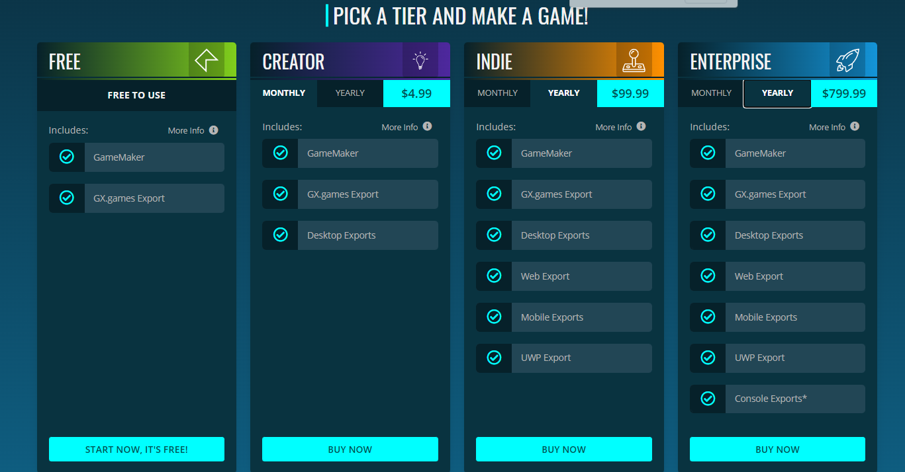

:::note Start

I am planning to start hte game dev. But my major question is what game engine?

<iframe width="100%" height="300" src="https://www.youtube.com/embed/UPYYHTjw-fY" title="YouTube video player" frameborder="0" allow="accelerometer; autoplay; clipboard-write; encrypted-media; gyroscope; picture-in-picture" allowfullscreen="true"></iframe>

:::

## Checking into different game engines.

| Metric               | Phaser | Unity | Gamemaker Studio 2 | Godot | Unreal Engine |
| -------------------- | ------ | ----- | ------------------ | ----- | ------------- |
| Learning Difficulty  | 6      | 7     | 2                  | 4     | 10            |
| Mobile Platform      | 3      | 9     | 9                  | ?     | 8             |
| Web Platform         | 10     | 8     | 8                  | 8     | 3             |
| Scalability          | 2      | 9     | 4                  | 6     | 10            |
| Cheap                | 10     | 8     | 1                  | 10    | 5             |
| Loading Speed        | 6      | 2     |
| Language Usefullness | 8      | 8     | 2                  | 1     | 7             |

### Escalability

This means how good are they at scaling up.

### Out of the question

- 3djs -> Too complex for your first game engine

## Gamemaker Studio 2 - For first game engine

:::caution There is a catch!

It is free to develop games, you have to pay for exporting it (Sharing to friends)

**However**
- As an instructor I can buy and export the games for you and just send you the files or publish them for you
- Of course I will not take any credits/profit form your game

:::

:::note Why GameMaker Studio 2

- Easy to learn
- Decent Scalability
- Compatibility with all type of platforms: Web browsers, Mobile Applications, 

**Showcase**

<iframe width="100%" height="1000" src="https://www.youtube.com/embed/FCJn91Cc7GY" title="YouTube video player" frameborder="0" allow="accelerometer; autoplay; clipboard-write; encrypted-media; gyroscope; picture-in-picture" allowfullscreen="true"></iframe>

:::

### Subscription Comparison

## Phaser - For fast loading games (Totally Free)

:::note Why Phaser

- Fast Loading

:::

## Phaser/Godot- Best for Chromebook

[Game Development on Chromebook with Godot](https://www.youtube.com/watch?v=J5z1Z3DUbNs)

While the case for Phaser is that it just needs a linux terminal + a programming field and that should be enough since it just needs a browser for loading it.

**Showcase**

<iframe width="100%" height="528" src="https://www.youtube.com/embed/R4e-u1i3Nt8" title="YouTube video player" frameborder="0" allow="accelerometer; autoplay; clipboard-write; encrypted-media; gyroscope; picture-in-picture" allowfullscreen="true"></iframe>

## Unity - Best for Serious Game Dev

<iframe width="100%" height="528" src="https://www.youtube.com/embed/na7EMenl2lY" title="YouTube video player" frameborder="0" allow="accelerometer; autoplay; clipboard-write; encrypted-media; gyroscope; picture-in-picture" allowfullscreen="true"></iframe>

:::note Reasons
**Pros**
- Allows 3D/2D
- Crossplatform Compatible
- Reasonable Difficulty
- Online Multiplayer

**Cons**
- Loading Speed

:::

## Study Plan

