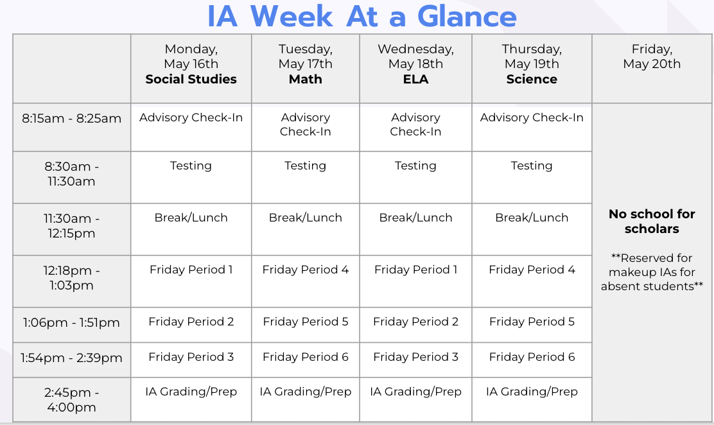

## Welcome Instructor

Notes for myself, for a quicker introduction to the class

## Quick Links

[Trinket](https://trinket.io/)

- [Master Schedule](https://docs.google.com/spreadsheets/d/17ky5IheQKcRjOY7D7QFcUIHW7Fx4yqGmbkacGc8RLJg/edit#gid=2004509751)
- [Class Tracker](https://docs.google.com/spreadsheets/d/1_z1_qaiyFfNYZjxRzmsalCTRoU-TVltnttfaMVB0FXc/edit#gid=1767484544)
- [Python Schedule](https://learn2codelive.com/courses/4)
- [Java Curriculum](https://learn2codelive.com/courses/107?invitation=xjBWlnfErS5sScvJxZlDpZ1XiYaS9VsNaTVvIW2e)
- [Nuasin School Calendar](https://nngcs.org/calendar/)

IA Week at a glance |
---|
 |

How to do the interviews. Train students into technical interviews.

You could get 

It's a very project: Data Science part on the part. Two years ago well developed. Also have an growing alumni
database two years ago, not as long, 8 year for web dev: They have a bigger group.

- Now the trend is that companies would like to have junior persons for Data Science jobs.
- This is really good opportunity and get in touch of the industry.
- Juniour role:

- Attended CUNY School
- Series of internships and Haking, Meta, Open Secrets, actively interviewing.

