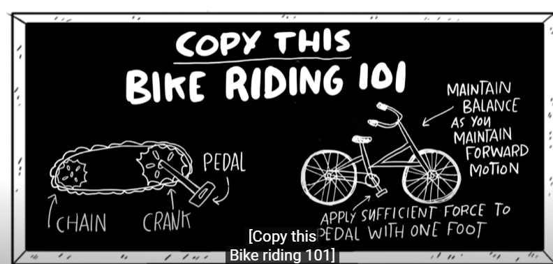
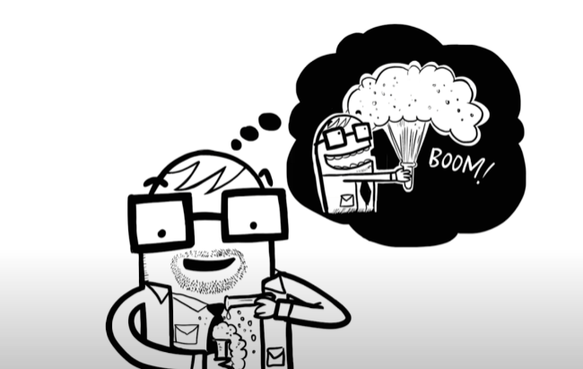

## Video Analyzis

:::tip Resources
- [What makes a good teacher great?](https://www.youtube.com/watch?v=vrU6YJle6Q4)

:::

| Note                                                  | Details                                                                                           | Support                                                                        |
| ----------------------------------------------------- | ------------------------------------------------------------------------------------------------- | ------------------------------------------------------------------------------ |
| Teachers don't Teach                                  | They show them and throw them into the pool, similar to how one's really learn how to ride a bike | https://youtu.be/vrU6YJle6Q4?t=440   |
| Teachers should be able to receive and trust students | Like receiving an apple and trust them.                                                           |
| A teacher is Chill                                    | Don't take it so seriously, don't be overwhelmed                                                  | https://youtu.be/vrU6YJle6Q4?t=177   |

