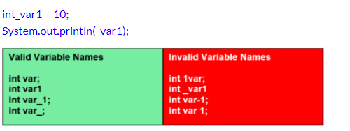

## Variables

Example Variables
```java
int age=15;
```

<details>
<summary>
🧪 Try the code out! 
</summary>
<iframe src="https://trinket.io/embed/java/e5ba4977ab" width="100%" height="150" frameborder="0" marginwidth="0" marginheight="0" allowfullscreen></iframe>

</details>

- Do you think you are able to change the printing message from `Hello World` to a different thing?

## Basic Math Operations using Variables

```java
  int num = 100;
  // Addition
  int sum    = 20 + 10;
  System.out.println(sum);

  // Subtraction
  int sub    = 20 - 10;
  System.out.println(sub);

  // Multiplication
  int mul    = 20 * 10;
  System.out.println(mul);

  // Division
  int div    = 20 - 10;
  System.out.println(div);

```

<details>
<summary>
🧪 Try the code out! 
</summary>
<iframe src="https://trinket.io/embed/java/7903edc271" width="100%" height="600" frameborder="0" marginwidth="0" marginheight="0" allowfullscreen></iframe>

</details>

### Example Program that adds two variables
```java
class Main{ //”class” is a keyword which is used to define a class.
  public static void main(String[] args) {
    System.out.println("PROGRAM TO ADD TWO NUMBERS");
    int num1 = 10; // num1 is a variable of int data type
    int num2 = 20; // num2 is a variable of int data type
    int sum = num1 + num2; //sum is a variable of int data type
    System.out.println(num1);
    System.out.println(num2);
    System.out.println(sum);
  }
}

```

### Rules for Defining Variables
It is important to follow the below guidelines to name a variable in java.

- A variable must start with a letter of the alphabet or an underscore (_).
- A variable name can have alphabets, numbers & underscore (_).
- No white space (spaces) is allowed within the variable name.
- Variable names are case sensitive.
- A variable name must not be any reserved word or keyword e.g. char, float etc.


<details>
<summary>
🧪 Try the code out! 
</summary>
<iframe src="https://trinket.io/embed/java/a89cdfe56d" width="100%" height="600" frameborder="0" marginwidth="0" marginheight="0" allowfullscreen></iframe>

</details>

## Concatenation

### Concatenating Words


```java
System.out.println("Pineapple " + " Pen");
```

<details>
<summary>
🧪 Try the code out! 
</summary>
<iframe src="https://trinket.io/embed/java/e48a0091fd" width="100%" height="300" frameborder="0" marginwidth="0" marginheight="0" allowfullscreen></iframe>

</details>

### You can also concatenate int and words

```java
int books = 51;
System.out.println("I have " + books + " books in my study");  

```

<details>
<summary>
🧪 Try the code out! 
</summary>
<iframe src="https://trinket.io/embed/java/9f4104cc68" width="100%" height="300" frameborder="0" marginwidth="0" marginheight="0" allowfullscreen></iframe>

</details>


[👀 E2 Practice 3](https://learn2codelive.com/courses/107/pages/lesson-1-learning-activities-e2-practice-activity-3-age-calculator?module_item_id=9031)

:::tip Activity: Age Calculator 
Write a Java program that uses year of birth and current year to calculate the age of a person. Make sure to output the year of birth, current year and age in a neatly formatted sentence.

Before you start, think about how many variables you will need for this activity.
Expected Output:
```
Age Calculator
---------------
Year Of Birth: 2005
Current Year: 2020
Age : 15
```

<details>
<summary>
✍ Solve the problem using Replit
</summary>
<a href="https://replit.com/@NeneWang/EmptyJavaCanvas#Main.java" >Feel free to use Repl, you can fork from this empty canvas in Repl.it</a>

</details>

<details>
<summary>
✍  You can solve the problem here using Trinket
</summary>
<iframe src="https://trinket.io/embed/java/6e661a677c" width="100%" height="600" frameborder="0" marginwidth="0" marginheight="0" allowfullscreen></iframe>

</details>

<details>
    <summary>
        💡 Hint Program: This program calculates when you will be 20.
    </summary>

<iframe src="https://trinket.io/embed/java/fdb7ec76da" width="100%" height="300" frameborder="0" marginwidth="0" marginheight="0" allowfullscreen></iframe>

</details>

:::


[👀 E2 Practice 4](https://learn2codelive.com/courses/107/pages/lesson-1-learning-activities-e2-practice-activity-4-hiking?module_item_id=9032)

:::tip Activity Hiking ⛰

Pete and Shannon are hiking. Shannon is always 2 miles ahead of Pete. What is the distance Shannon has covered if Pete has covered 10 miles? How would the program change if Shannon has covered twice as much distance as Pete?
The output should look something like this:
```
If Shannon is two miles ahead of Pete, distance hiked by Shannon is 12 miles

If Shannon covers twice as much distance as Pete, distance travelled by Shannon is 20 miles
```
<details>
<summary>
✍ Solve the problem using Replit
</summary>
<a href="https://replit.com/@NeneWang/EmptyJavaCanvas#Main.java" >Feel free to use Repl, you can fork from this empty canvas in Repl.it</a>

</details>

<details>
<summary>
✍  You can solve the problem here using Trinket
</summary>
<iframe src="https://trinket.io/embed/java/6e661a677c" width="100%" height="600" frameborder="0" marginwidth="0" marginheight="0" allowfullscreen></iframe>

</details>

:::


