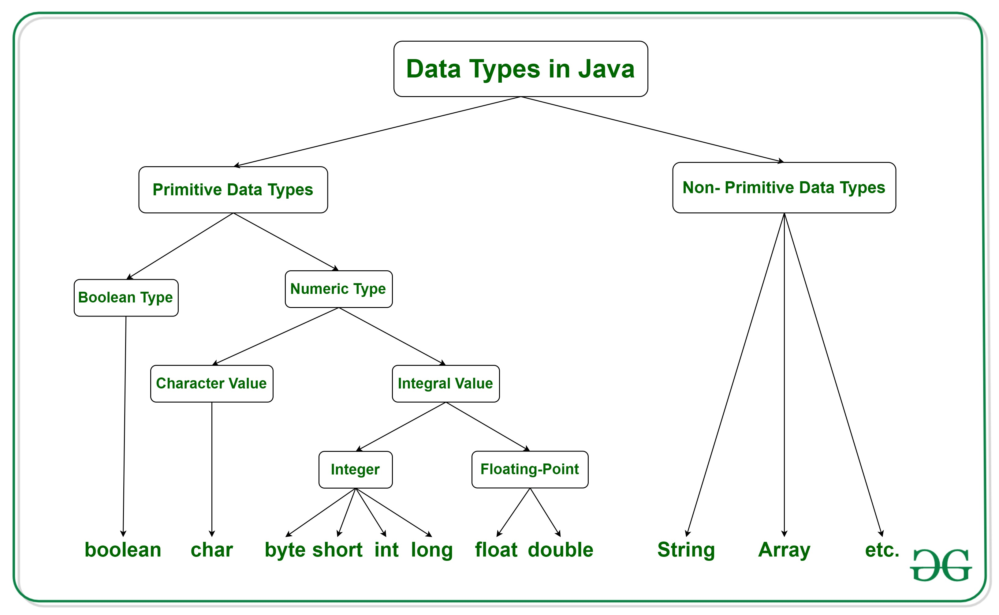

## Data Types
:::note Data Types Tree


Image extracted from [Geek for Geeks](https://www.geeksforgeeks.org/data-types-in-java/)
:::


| Data Type | Size    | Description                                                                       |
| --------- | ------- | --------------------------------------------------------------------------------- |
| boolean   | 1 bit   | Stores true or false                                                              |
| char      | 2 bytes | Stores a single character i.e. 'a'. '1' etc.                                      |
| byte      | 1 byte  | Stores whole numbers from -128 to 127                                             |
| short     | 2 bytes | Stores whole numbers from -32,768 to 32,767                                       |
| int       | 4 bytes | Stores whole numbers from -2,147,483,648 to 2,147,483,647                         |
| long      | 8 bytes | Stores whole numbers from -9,223,372,036,854,775,808 to 9,223,372,036,854,775,807 |
| float     | 4 bytes | Sufficient for storing 6 to 7 decimal digits                                      |
| double    | 8 bytes | Stores decimal numbers. It can store up to 15 decimal digits.                     |

- Don't worry about the size in this class yet!

## Working with Variables

Lets start by looking at some data types for variables

| Data Type | Size    | Description                                               |
| --------- | ------- | --------------------------------------------------------- |
| int       | 4 bytes | Stores whole numbers from -2,147,483,648 to 2,147,483,647 |
| short     | 2 bytes | Stores whole numbers from -32,768 to 32,767               |

### Variable Declarations
```java
int myInteger = 23;
short myShort = 50;
```

Checking datatype's size
```java
System.out.println("Size of short: " + (Short.SIZE / 8) + " bytes.");
System.out.println("Size of int: " + (Integer.SIZE / 8) + " bytes.");
```


<details>
<summary>
🧪 Try the code out! 
</summary>
<iframe src="https://trinket.io/embed/java/e694e1d8b3" width="100%" height="600" frameborder="0" marginwidth="0" marginheight="0" allowfullscreen></iframe>

</details>

## Arithmetic Operators

| Operator | Name           | Description                            | Example |
| -------- | -------------- | -------------------------------------- | ------- |
| +        | Addition       | Adds together two values               | x + y   |
| -        | Subtraction    | Subtracts one value from another       | x - y   |
| *        | Multiplication | Multiplies two values                  | x * y   |
| /        | Division       | Divides one value by another           | x / y   |
| %        | Modulus        | Returns the division remainder         | x % y   |
| ++       | Increment      | Increases the value of a variable by 1 | x++     |
| --       | Decrement      | Decreases the value of a variable by 1 | x--     |

### Using Math Operators
```java
public class Main {
 public static void main(String[] args) {
   int num=100;
   //Add
   int sum    = 20 + 10;
   System.out.println(sum);

   //Subtraction
   int sub    = 20 - 10;
   System.out.println(sub);

   //multiply
   int mul    = 20 * 10;
   System.out.println(mul);

   //divide
   int div    = 20 - 10;
   System.out.println(div);

   //modulo
   int modulo = 20 % 10;
   System.out.println(modulo);

   //increment
   num++;
   System.out.println(num);

   //decrement
   num--;
   System.out.println(num);
 }
}
```
<details>
<summary>
🧪 Try the code out! 
</summary>
<iframe src="https://trinket.io/embed/java/4ae86c0fd1" width="100%" height="400" frameborder="0" marginwidth="0" marginheight="0" allowfullscreen></iframe>

</details>

## Compound Assigment Operator

| operator | Definition                    |
| -------- | ----------------------------- |
| +=       | Addition and assignment       |
| -=       | Subtraction and assignment    |
| *=       | Multiplication and assignment |
| /=       | Division and assignment       |
| %=       | Remainder and assignment      |
### 👨🏻‍💻 Compound assignment operator example

```java
 int a =20;
   int b =20;
   
   System.out.println(a);
   System.out.println(b);
   
   a += 15;
   System.out.println("a is " + a);
   
   b = 15 + b;
   System.out.println("b is " + b);
   
   a -= 3;
   System.out.println("a is " + a);
```

<details>
<summary>
🧪 Try the code out! 
</summary>
<iframe src="https://trinket.io/embed/java/2bfb91b7e7" width="100%" height="1200" frameborder="0" marginwidth="0" marginheight="0" allowfullscreen></iframe>

</details>

[👀 Practice Activity](https://learn2codelive.com/courses/107/pages/lesson-2-learning-activities-r-practice-activity-1-prediction-with-integer-data-type-and-math-operations?module_item_id=9048)

## Integrated Example
*Here an example showing everything together, please feel free to try it out!*

The following program prints makes operations with differents variables you can try the code out below!

```java
  int a = 4;
  int b = 3;
  int num1 = 5;
  int num2 = 4;
  System.out.println("a+b = " + (a + b)); //a + b evaluates to  7
  //println() - inserts newline character
  //print() -will continue on printing in the same line
  System.out.println("a-b = " + (a - b)); //a - b evaluates to  1
  System.out.println("a*b = " + (a * b)); //a * b evaluates to  7
  System.out.println("a%b = " + (a % b)); //a % b evaluates to  1 ,as it returns remainder
  a++; //increments the value of a by 1, so a becomes 5
  System.out.println("a = " + a);
  a--; //decrements the value of a by 1, so a becomes 4
  System.out.println("a = " + a);
  // a+=b equivalent or short form of a=a+b;
  // a-=b equivalent or short form of a=a-b;
  System.out.println("num1 + num2 = " + (num1 + num2));
  num1 += num2; //num1 will be added to num2 and stored in num1, so num1=9
  System.out.println("num1 + num2 = " + num1);
  //subtraction
  System.out.println("num1 - num2 = " + (num1 - num2));
  num1 -= num2; // num2 will be subtracted to num1 and stored in num1, so num1=5 (9-4=5)
  System.out.println("num1 - num2 = " + num1);
  //------increment operation----
  // ++ (increment operator) is equivalent to a=a+1 (a++ is equivalent to a=a+1)
  //prefix
  System.out.println("prefixed a = " + (++a)); // a becomes 5
  //postfix
  System.out.println("postfixed a = " + (a++)); // a becomes 6 but after assignment. Here it will print original value(before postfix increment operation)
  System.out.println("postfixed a =" + a); // postfix operation can be checked here
  //----decrement operator----
  // --(decrement operator)is equivalent to a=a-1 (a-- is equivalent to a=a-1)
  //prefix
  System.out.println("prefixed a = " + --a); // a becomes 5
  //postfix
  System.out.println("postfixed a = " + a--); // Ask students what they think this does?
  // a becomes 4 but after assignment.Here it will print original value(before postfix decrement operation)
  System.out.println("postfixed a = " + a); //a=4, postfix operation can be checked here

```


<details>
<summary>
🧪 Try the code out! 
</summary>
<iframe src="https://trinket.io/embed/java/28a729f904" width="100%" height="600" frameborder="0" marginwidth="0" marginheight="0" allowfullscreen></iframe>

</details>

## Class Excercise:

:::tip Exercise 1: 🔨 Fix the following code Piggy Bank 🐖🏦

This is the prompt
Rene has $29.80 in her piggy bank. Rene’s dad has promised to give her $2.50 if she takes out trash. Her mom has promised to give her another $2.50 if she does her laundry. Her mom and dad have also promised to give her $2.75 if she walks the dog. Write a program that calculates the money that Rene will have if she does all the three chores. Use variables for each number and output the result in a complete sentence. Before you start, think about the data type(s) that you will use and why.


The following code **should print**:
```output
Piggy bank bal : 29.8
Total amount after Trash Cleaning : 29.8 + 2.5 = 32.3
Total amount after doing Laundry : 32.3 + 2.5 = 34.8
Total amount after taking dog on walk : 34.8 + 2.75 = 37.55
```

**But instead** it prints this:
```Output
Piggy bank bal : 29.8
Total amount after Trash Cleaning : 29.8 + 2.5 = 29.82.5
Total amount after doing Laundry : 32.3 + 2.5 = 32.32.5
```

Code with error:
```java
public class Main {
  public static void main(String args[]) {
      float piggy_bank_bal = 29.80f;// what will happen when we make it 'int'
      float earning_from_trash = 2.50f;
      float earning_from_laundry = 2.50f;
      float earning_from_petsitter = 2.75f;
      float total = piggy_bank_bal;
      System.out.println("Piggy bank bal : " + piggy_bank_bal);
      System.out.println("Total amount after Trash Cleaning : " + total + " + " + earning_from_trash + " = " + total + earning_from_trash);
      total = total + earning_from_trash; //total calculation after trash cleaning
      System.out.println("Total amount after doing Laundry : " + total + " + " + earning_from_laundry + " = " + total + earning_from_laundry);
      total = total + earning_from_laundry; //total calculation after laundry
      System.out.println("Total amount after taking dog on walk : " + total + " + " + earning_from_petsitter + " = " + total + earning_from_petsitter);
  }
}
```


<details>
<summary>
✍ Solve the problem using Replit
</summary>
<a href="https://replit.com/@NeneWang/EmptyJavaCanvas#Main.java" >Feel free to use Repl, you can fork from this empty canvas in Repl.it</a>

</details>

<details>
<summary>
✍  You can solve the problem <b>here</b> using Trinket
</summary>
<iframe src="https://trinket.io/embed/java/eebac3afea" width="100%" height="600" frameborder="0" marginwidth="0" marginheight="0" allowfullscreen></iframe>
</details>


:::
<!-- 


:::tip Exercise 1 🐖🏦 Piggy Bank

Rene has $29.80 in her piggy bank. Rene’s dad has promised to give her $2.50 if she takes out trash. Her mom has promised to give her another $2.50 if she does her laundry. Her mom and dad have also promised to give her $2.75 if she walks the dog. Write a program that calculates the money that Rene will have if she does all the three chores. Use variables for each number and output the result in a complete sentence. Before you start, think about the data type(s) that you will use and why.


<details>
<summary>
✍ Solve the problem using Replit
</summary>
<a href="https://replit.com/@NeneWang/EmptyJavaCanvas#Main.java" >Feel free to use Repl, you can fork from this empty canvas in Repl.it</a>

</details>

<details>
<summary>
✍  You can solve the problem <b> here </b>using Trinket
</summary>
<iframe src="https://trinket.io/embed/java/6e661a677c" width="100%" height="600" frameborder="0" marginwidth="0" marginheight="0" allowfullscreen></iframe>

</details>
:::


 -->


