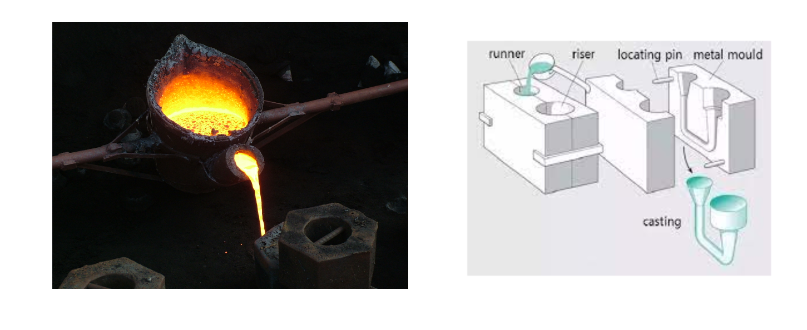

## Typecasting


:::note Casting

We can sort of do something similar in Java, but with Variable Types
Images extracted from [P Akthy](https://en.wikipedia.org/wiki/Casting#/media/File:Cast_iron_melting.JPG) and [machinemfg](https://www.machinemfg.com/types-of-casting/)
:::

```java
float myFloat = 1.5f;
int myInt = (int) myDouble; // changes double to int 
```

:::caution Typecasting might lead to loss of precision
In Implicit conversions, one data type is automatically converted into another if found compatible, but it should be in the right order else it may lead to loss of precision.
 
 ```
 char->short-> int->float->double->long
 ```
:::

<details>
    <summary>
      📚 Explicit & Implicit?
    </summary>

- **Explicit**: stated clearly and in detail, leaving no room for confusion or doubt.
- **Implicit**: implied though not plainly expressed.

</details>

### Example Implicit Typecasting
```java
public class Main {
 public static void main(String args[]) {
 int x = 10; // integer x
 char y = 'a'; // character c
 // x is implicitly converted to float
 float z =x + 1.0f;
 System.out.println("x = " + x );
 System.out.println("y = " + y );
 System.out.println("z = " + z );
 }
}
```

Output
```
x = 10
y = a
z = 11.0
```


<details>
<summary>
🧪 Try the code out! 
</summary>
<iframe src="https://trinket.io/embed/java/67bc304013" width="100%" height="600" frameborder="0" marginwidth="0" marginheight="0" allowfullscreen></iframe>

</details>


### Example Explicit Typecasting

```java
public class Main {

public static void main(String args[]) {
  double d=1.6;
  int val=(int)d; //casting from double to int
  System.out.println("val = "+val );
  }
}
```
Output
```
val = 1
```

<details>
<summary>
🧪 Try the code out! 
</summary>
<iframe src="https://trinket.io/embed/java/22d570ec86" width="100%" height="300" frameborder="0" marginwidth="0" marginheight="0" allowfullscreen></iframe>

🙋‍♂️ Analysis
- Why do you think that the code prints `1` instead of `1.6`?


</details>