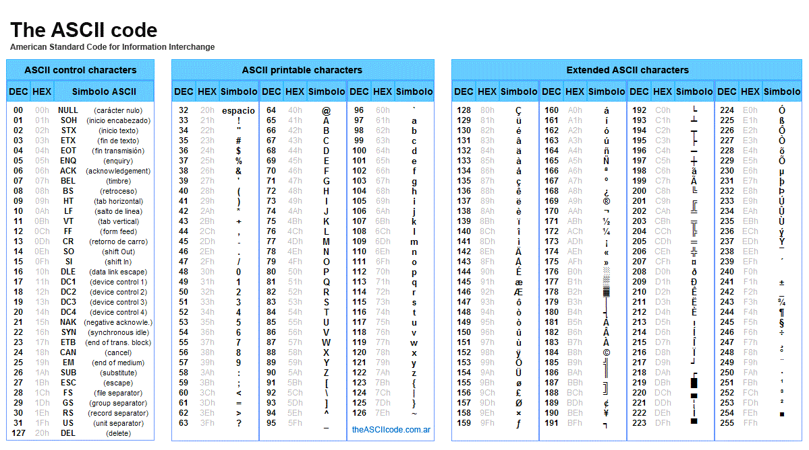

The char data type is used to store a single character. The character must be surrounded by single quotes, like 'A' or 'c':


```java
char x = 'a';    
System.out.print(x);
```

<details>
<summary>
🧪 Try the code out! 
</summary>
<iframe src="https://trinket.io/embed/java/e7f24f3e3b" width="100%" height="300" frameborder="0" marginwidth="0" marginheight="0" allowfullscreen></iframe>

</details>


## The ASCII code



```java
char x = 97;
System.out.println(x);    //Should print 'a'
```
<details>
<summary>
🧪 Try the code out! 
</summary>
<iframe src="https://trinket.io/embed/java/94390bd149" width="100%" height="200" frameborder="0" marginwidth="0" marginheight="0" allowfullscreen></iframe>

</details>


## Upper and Lower Case
```java
public class Main
{
 public static void main(String[] args) 
 {
   char ch1 = 'a';
   char ch2 = 'B';
   System.out.println(Character.toUpperCase(ch1));//converts lowercase to uppercase
   System.out.println(Character.toLowerCase(ch2));//converts uppercase to lowercase
 }
}
```


<details>
<summary>
🧪 Try the code out! 
</summary>
<iframe src="https://trinket.io/embed/java/ccf08839d2" width="100%" height="600" frameborder="0" marginwidth="0" marginheight="0" allowfullscreen></iframe>

</details>

## Chars and ASCII In Practice
<details>
<summary>
✍ Try the following examples in this playground
</summary>
<iframe src="https://trinket.io/embed/java/1052b8dca8" width="100%" height="600" frameborder="0" marginwidth="0" marginheight="0" allowfullscreen></iframe>

</details>


What happens when we try to store a char value in an integer?
```java
public class Main {
    public static void main(String args[]) {
    int val='A';
    System.out.println("val = " +val);
    }`
} 
```

What happens when we typecast an int value to a char type?
```java
public class Main {
 public static void main(String[] args) {
   int x = 5;
   char y = (char)x;  
   System.out.println(x + y);  
 }
}
```


What happens we try to add a char to an integer?

*Java will take ASCII value of char and add it to the int, so the result will be unpredicted. Try this:*
```java

int x = 5;
char y = '5';
System.out.println (x + y);
```

```SHELL
OUTPUT: 58 (because it will take ASCII value of '5' that is 53 and add it to 5)
```

What is the output seen when combining int and String variables? 

*if x = 5 and y = “6”, then output is 56 (string concatenation). Anything added to string is converted to string in java.*
```java
public class Main {
 public static void main(String[] args)    
   {   
       int x = 5;
       String y = "6";
       System.out.println(x + y);
   } 
}
```

