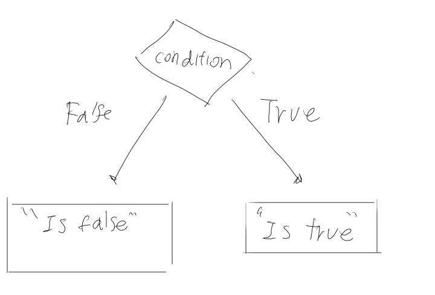
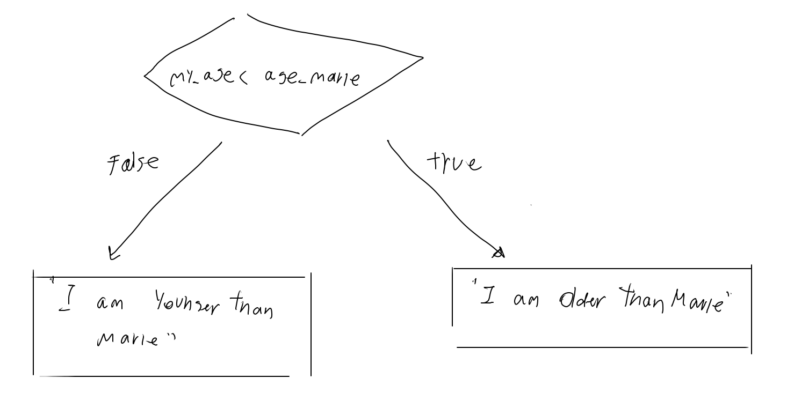
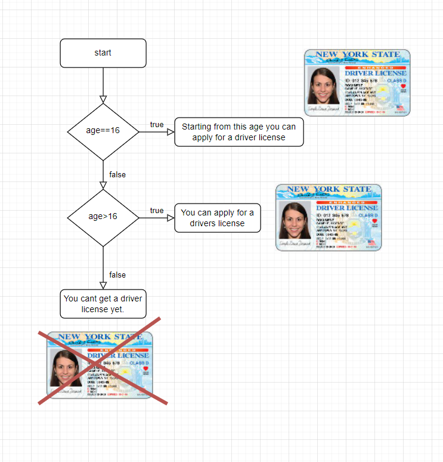

## Conditional Structure

[👀 Reading Notes](https://learn2codelive.com/courses/107/pages/lesson-4-learning-activities-r-reading-material-for-conditionals?module_item_id=9115)


### If Else

```java
public class Main {
  public static void main(String[] args) {
    if(false){
      System.out.println("Is True");
    }else {
      System.out.println("Is False");
    }
  }
}
```
<details>
<summary>
🧪 Try the code out~!
</summary>
<iframe src="https://trinket.io/embed/java/641a2a9c9e" width="100%" height="600" frameborder="0" marginwidth="0" marginheight="0" allowfullscreen></iframe>

</details>

import RadioListAns from "@site/src/components/RadioListAns.js";

***

:::tip Practice
-  What do you think the program will be printing if we change `false` to `true` in `line 3`?

<RadioListAns checkList={["it prints 'Is True'", "it prints 'Is False'"]} answer={1} >
</RadioListAns>

:::

***


### Using Comparisons to resolve If Else conditionals




```java
class Main{
 public static void main (String args[]){
    int my_age    = 21;
    int age_marie  = 25;
   
     if(my_age < age_marie){
       System.out.println("I am Younger than Marie");
     }else if(my_age > age_marie){
       System.out.println("I am Older than Marie");
     }
   }
}
```

<details>
<summary>
🧪 Try the code out~!
</summary>

<iframe src="https://trinket.io/embed/java/abcbd41ace" width="100%" height="600" frameborder="0" marginwidth="0" marginheight="0" allowfullscreen></iframe>

</details>


:::note Comparison Operators


| Comparison Operator | Definition       | Example                     |
| ------------------- | ---------------- | --------------------------- |
| `==`                | Equals           | 2==2 -> True, 2==4 -> False |
| `!=`               | Not Equal        | 2!=3 -> True, 2!=2 -> False |
| `>`                 | Larger           | 3>2 -> True                 |
| `<`                 | Smaller          | 4 < 5 -> True               |
| `>=`                | Larger or Equals | 4 >= 2 -> True, 2>=2 -> Tru |

:::

### Else IF

:::note


- I created this using [draw.io](https://draw.io/)
:::

```java

public class Main {
  public static void main(String[] args) {
    
    int age = 17;
    if(age == 17){
      System.out.println("Age is 17");
    }else if(age>17) {
      System.out.println("You are an adult now");
    }else{
      System.out.println("You are still a kid.");
    }
  }
}
```

Explaination:
```java
If (Boolean condition1) Then

    (perform computation or action)

Else if (Boolean condition2) Then

    (perform another computation or action)

Else
    (perform a default computation or action)
```

<details>
<summary>
🧪 Try the code out~!
</summary>
<iframe src="https://trinket.io/embed/java/e7864d63c6" width="100%" height="600" frameborder="0" marginwidth="0" marginheight="0" allowfullscreen></iframe>

</details>

<!-- ## Lesson 4 Learning Activities [E1] : Introduce Logical Conditionals

[👀](https://learn2codelive.com/courses/107/pages/lesson-4-learning-activities-e1-introduce-conditionals?module_item_id=9114) -->


*** 

:::tip Exercise

[👀 Exercise in the curriculum](https://learn2codelive.com/courses/107/pages/lesson-4-learning-activities-r-practice-activity-3-math-works?module_item_id=9116)

Complete the following program so that it prints if  number is positive or not.
- If the input is positive it should print: `num is positive.`
- else If the input is negative it should print: `num is negative`
- else (the case where input is neither positive or negative) it should print: `num is ZERO (0)`


<iframe src="https://trinket.io/embed/java/a02cd37708" width="100%" height="600" frameborder="0" marginwidth="0" marginheight="0" allowfullscreen></iframe>

***

🙋‍♀️ Sample expected program:

- Try entering `5`
- Try entering `-5`
- Try entering `0`

<iframe src="https://trinket.io/embed/java/8621801351?outputOnly=true" width="100%" height="300" frameborder="0" marginwidth="0" marginheight="0" allowfullscreen></iframe>


:::


### Nested Conditionals

[👀 Curriculum - Nested Conditionals](https://learn2codelive.com/courses/107/pages/lesson-4-learning-activities-r-reading-material-for-conditionals?module_item_id=9115)

```java
public class Main{
 public static void main(String args[]){ 
 int num = 25;
 
 
 if (num >5){
   System.out.println("num is greater than 5");
   if(num>10){
      System.out.println("num is larger than 10");
      if(num>20){
        System.out.println("num is larger than 20");       
      }
   }
  }else if(num<0){  
    System.out.print ("num is negative");
    
  }else{
    System.out.print ("num is ZERO (0)");
  }
 }
}
```

:::tip Answer the following:

1. What do you think it will print if num is 15
<RadioListAns checkList={["num is greater than 5", "num is greater than 5, num is larger than 10", "num is greater than 5, num is larger than 10, num is larger than 20"]} answer={2} >
</RadioListAns>

2. What do you think it will print if num is 20
<RadioListAns checkList={["num is greater than 5", "num is greater than 5, num is larger than 10", "num is greater than 5, num is larger than 10, num is larger than 20"]} answer={2} >
</RadioListAns>

3. What do you think it will print if num is 25
<RadioListAns checkList={["num is greater than 5", "num is greater than 5, num is larger than 10", "num is greater than 5, num is larger than 10, num is larger than 20"]} answer={3} >
</RadioListAns>

<details>
<summary>
🧪 Try the code out~!
</summary>

<iframe src="https://trinket.io/embed/java/68c3d59f21" width="100%" height="600" frameborder="0" marginwidth="0" marginheight="0" allowfullscreen></iframe>
</details>
:::


