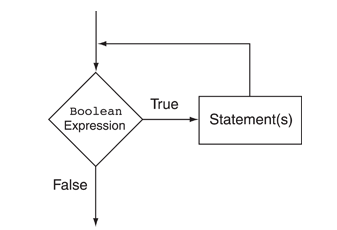
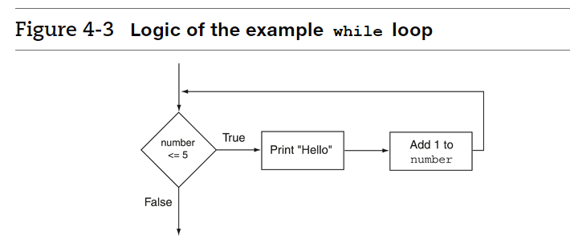
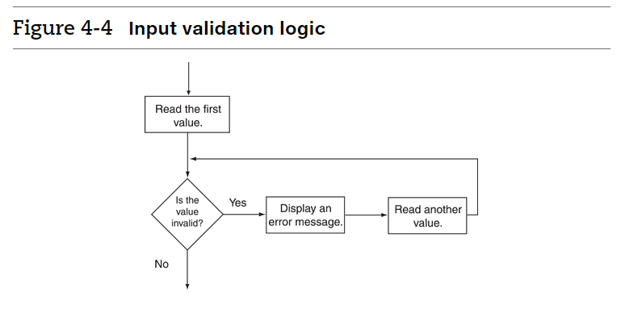

:::note While Loop



The BooleanExpression is tested, and if it is true, the Statement is executed. Then, the BooleanExpression is tested again. If it is true, the Statement is executed. This cycle repeats until the BooleanExpression is false.

:::

## While Loop


```java
import java.util.*;
class Main {
  public static void main(String[] args) {
    int number = 0;
    while (number<5)
    {
        System.out.println("Hello");
        number++;
    }
    
  }
}
```


<details>
<summary>
🧪 Try the code out~!
</summary>
<iframe src="https://trinket.io/embed/java/0aa8aff94e" width="100%" height="600" frameborder="0" marginwidth="0" marginheight="0" allowfullscreen></iframe>

</details>




### Practice

```java
int count = 10;
while (count < 1)
{
    System.out.println("Hello World");
    count++;
}
```

How many times will that code print `Hello World`?

import RadioListAns from "@site/src/components/RadioListAns.js";

<RadioListAns checkList={["5 times", "10 times"]} answer={2}></RadioListAns>


## Infinite Loops

:::caution Be careful and avoid creating an infinite loop


- Infinite Loops

This code will be printing `Hello` forever


```java
import java.util.*;
class Main {
  public static void main(String[] args) {
   int number = 1;
    while (number <= 5)
    {
       System.out.println("Hello");
    }
    
  }
}
```

<details>
<summary>
🧪 Try the code out~!
</summary>
<iframe src="https://trinket.io/embed/java/df212d025f" width="100%" height="300" frameborder="0" marginwidth="0" marginheight="0" allowfullscreen></iframe>

</details>

:::

### Exercise: Throwing random numbers

:::tip Create a program that throws random numbers...

1. Create a program that generates random numbers from 0-9 (0 and 9 included) 5 times
2. Modify it so that it now generates 100 random numbers

***

You can create your program using the following template.

<iframe src="https://trinket.io/embed/java/eae3e912b1" width="100%" height="600" frameborder="0" marginwidth="0" marginheight="0" allowfullscreen></iframe>

***


<details>
<summary>
Hint
</summary>

This is the code to print a random number from 0-100
<iframe src="https://trinket.io/embed/java/286df0d784" width="100%" height="600" frameborder="0" marginwidth="0" marginheight="0" allowfullscreen></iframe>

</details>

🙋‍♀️ Expected Program (1) 5 random numbers from 0-9

<iframe src="https://trinket.io/embed/java/55795bac9c?outputOnly=true" width="100%" height="300" frameborder="0" marginwidth="0" marginheight="0" allowfullscreen></iframe>


🙋‍♀️ Expected Program (2) - 100 random numbers

<iframe src="https://trinket.io/embed/java/9befbc2c17?outputOnly=true" width="100%" height="600" frameborder="0" marginwidth="0" marginheight="0" allowfullscreen></iframe>

:::


## Using While Loops to Validate Inputs



```java

import java.util.*;
class Main {
  public static void main(String[] args) {
  int number;

  // Create a Scanner object for keyboard input.
  Scanner keyboard = new Scanner(System.in);
  
  // Get a number from the user.
  System.out.print("Enter a number in the range of 1 through 100: ");
  number = keyboard.nextInt();
  
  // Validate the input.
  while (number < 1 || number > 100)
  {
     System.out.print("Invalid input. Enter a number in the range " +
                      "of 1 through 100: ");
     number = keyboard.nextInt();
  }
    
  }
}

```
<details>
<summary>
🧪 Try the code out~!
</summary>
<iframe src="https://trinket.io/embed/java/ec17c20097" width="100%" height="400" frameborder="0" marginwidth="0" marginheight="0" allowfullscreen></iframe>

</details>


### Exercise: Generate Random numbers until...

:::tip Exercise

- Create a program that generates random numbers from 0-9 until it generates number 5
- You can use the following template to start your code:

<iframe src="https://trinket.io/embed/java/baa22568ba" width="100%" height="600" frameborder="0" marginwidth="0" marginheight="0" allowfullscreen></iframe>

***

🙋‍♀️ Expected Program

<iframe src="https://trinket.io/embed/java/cf21d88f13?outputOnly=true" width="100%" height="300" frameborder="0" marginwidth="0" marginheight="0" allowfullscreen></iframe>


:::


