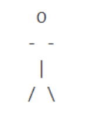
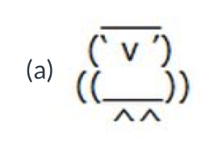

## Printing Messages
```python
print ("Hello World!")  # Print a message using double quotes
print ('Hello World!')  # Print a message using single quotes
```
<details>
<summary>
🧪 Try the code out! 
</summary>
<iframe src="https://trinket.io/embed/python3/42877e453f" width="100%" height="600" frameborder="0" marginwidth="0" marginheight="0" allowfullscreen></iframe>

</details>

## Printing numbers
```python
# This program displays some stuff  # Line 3
print ("Welcome to Python Programming")    # Line 4
print ("Try coding, it's fun. Do you know what is 123456789*123456789?") # Line 5
print (123456789*123456789)    # Line 6
```
Output
```output
# This program displays some stuff  # Line 3
print ("Welcome to Python Programming")    # Line 4
print ("Try coding, it's fun. Do you know what is 123456789*123456789?") # Line 5
print (123456789*123456789)    # Line 6
```
<details>
<summary>
🧪 Try the code out! 
</summary>
<iframe src="https://trinket.io/embed/python3/59c912d464" width="100%" height="600" frameborder="0" marginwidth="0" marginheight="0" allowfullscreen></iframe>

</details>


## Details

[👀](https://learn2codelive.com/courses/4/pages/lesson-1-learning-activities-r-practice-activity-1-build-and-test-the-code?module_item_id=458)


```python
print('Hello\n World') # Move to the next line after Hello
print('') # Leave an empty line on console
print('Hello\nWorld') # Move to the next line after Hello, white space before World has been removed here

print('\nDemonstration of backslash')
# print('\') # uncommenting this line will cause an error
print('\\') # to print a backslash, you need to escape with another backslash
```

<details>
<summary>
🧪 Try the code out! 
</summary>
<iframe src="https://trinket.io/embed/python3/31d9da2a08" width="100%" height="356" frameborder="0" marginwidth="0" marginheight="0" allowfullscreen></iframe>
</details>


[👀](https://learn2codelive.com/courses/4/pages/lesson-1-python-challenge-1a-code-art?module_item_id=447)

## Example

:::important Printing a Human Character
Let's say we want to create the following figure:



<details>
<summary>
🔬 Solution 
</summary>
Try out this solution
<iframe src="https://trinket.io/embed/python3/979c707fa0" width="100%" height="356" frameborder="0" marginwidth="0" marginheight="0" allowfullscreen></iframe>


</details>

:::

:::tip Problem 1
Let's say you want to create the following figure:



:::


<details>
<summary>
📝 Solve this problem in <a target="_blank" href="https://trinket.io/">Trinket</a> or <b>here</b>
</summary>
<iframe src="https://trinket.io/embed/python3/6c5d05a988" width="100%" height="600" frameborder="0" marginwidth="0" marginheight="0" allowfullscreen></iframe>

</details>

<details>
<summary>
💡 Hints 
</summary>

- What are the different characters that have been used to create this shape?
- How will you get the spacing right? What lines are the characters on? Hint: Use a table and add the different characters in the cells as they appear in the image. Or simply align the characters on your code editor first.
- Write down the instructions needed to create this graphic in the Instructions window of your Trinket.

</details>


[👀](https://learn2codelive.com/courses/4/pages/lesson-1-learning-activities-r-practice-activity-1-build-and-test-the-code?module_item_id=458)

[👀Assessment Quiz](https://learn2codelive.com/courses/4/pages/lesson-1-assessment-quiz?module_item_id=449)


