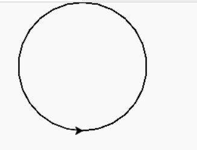
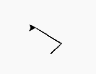
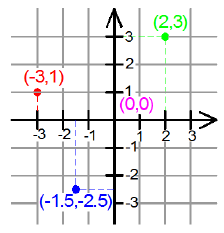
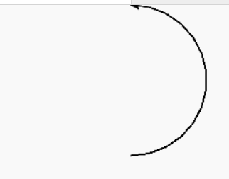
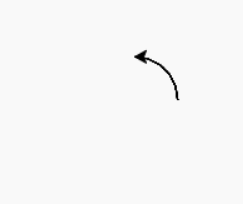
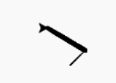
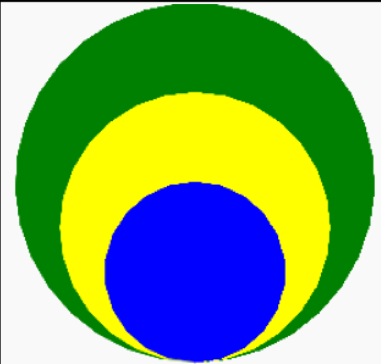

## Turtle

We first need to import turtle so we can start using turtle functions


```python
import turtle
```
<details>
<summary>
What is Turtle? 🐢
</summary>

a pre-installed Python library that enables users to create pictures and shapes by providing them with a virtual canvas
<iframe src="https://trinket.io/embed/python/553d685b05" width="100%" height="356" frameborder="0" marginwidth="0" marginheight="0" allowfullscreen></iframe>
</details>

<details>
<summary>
What is a library? 📚 
</summary>
In python libraries are a collection of modules, containing code that can be
used in different programs.


**Analogy**: Suppose you have a set of questions about Biology, I don't know much about
biology, so Ideally I would like to invite (import) a biology teacher to our
class so you can ask him biology questions.


```python
#The biology teacher library probably doesn't exist, but this is just to show how this would it would translate in code
import biology_teacher
# We invite our biology teacher to the room

biology_teacher.askBiologyQuestion("Can I turn my cat into diamond?")
# and now we are asking our biology teacher a biology related question


```

**Why is it useful?**
Is useful to have libraries as a way to get access to precreated code that can
help us accelerate our programming (so we can focus on creating what we want
instead of the details of something)

</details>


### Drawing a circle

```python
import turtle

turtle.circle (100) # draws a circle with radius 100

```



<details>
<summary>
🧪 Try the code out! 
</summary>
<iframe src="https://trinket.io/embed/python/a4f2245773?start=result" width="100%" height="300" frameborder="0" marginwidth="0" marginheight="0" allowfullscreen></iframe>

</details>


### Moving to Coordinates 🗺
We can out the pen down when we are ready to draw

```python
import turtle

turtle.goto(20, 20)
turtle.goto(-30, 50)

# turtle.home() #goes to (0,0)
```



<details>
<summary>
What are coordinates?
</summary>



</details>


<details>
<summary>
🧪 Try the code out! 
</summary>
<iframe src="https://trinket.io/embed/python/e35694aae3" width="100%" height="300" frameborder="0" marginwidth="0" marginheight="0" allowfullscreen></iframe>
</details>

```python
import turtle

turtle.circle (50, 180) # draws a semi-circle (first parameter is radius, second is degrees)

```



<details>
<summary>
🧪 Try the code out! 
</summary>
<iframe src="https://trinket.io/embed/python/9d34972885" width="100%" height="600" frameborder="0" marginwidth="0" marginheight="0" allowfullscreen></iframe>

</details>

<details>
<summary>
🙋‍♂️ What do you think we would need to do in order to draw a quarter-circle with 40 of radio?
</summary>

```python
import turtle
turtle.circle (50, 360/4) # or 90
```
<details>
<summary>
🧪 Try the code out! 
</summary>
<iframe src="https://trinket.io/embed/python/7f899ec800" width="100%" height="600" frameborder="0" marginwidth="0" marginheight="0" allowfullscreen></iframe>

</details>


</details>

### Turtle Shape 🐢 ⚪ ⬛

We can change how the pen looks like
```python
turtle.shape('arrow')

turtle.shape('turtle')

turtle.shape('circle')

turtle.shape('square')

turtle.shape('triangle')

turtle.shape('classic')
```


<details>
<summary>
🧪 Try the code out! 
</summary>
<iframe src="https://trinket.io/embed/python/7153a4c734?start=result" width="100%" height="300" frameborder="0" marginwidth="0" marginheight="0" allowfullscreen></iframe>

</details>


### Picking the Pen up and down ✒

```python
turtle.penup()
turtle.circle (40, 360/4) 
turtle.pendown()
turtle.circle (40, 360/4) 
```



<details>
<summary>
🧪 Try the code out! 
</summary>
<iframe src="https://trinket.io/embed/python/f9fc67c57a?start=result" width="100%" height="300" frameborder="0" marginwidth="0" marginheight="0" allowfullscreen></iframe>

</details>


### Colors

[Colors supported in Trinket](https://trinket.io/docs/colors)

```python
turtle.color("yellow") # is used to set the colour of the drawn line
turtle.fillcolor("yellow") # is used to set the color that should be used to fill the drawn figure

```

<details>
<summary>
🧪 Try the code out! 
</summary>
<iframe src="https://trinket.io/embed/python/62caae5597?start=result" width="100%" height="300" frameborder="0" marginwidth="0" marginheight="0" allowfullscreen></iframe>

</details>


### Speed 🏃‍♂️
```python

turtle.speed(5) # speed varies from 0 to 10
turtle.speed(0) # 10 is the fastest, and speed increases from 1 to 10
```


<details>
<summary>
🧪 Try the code out! 
</summary>
<iframe src="https://trinket.io/embed/python/aced5f41ad" width="100%" height="300" frameborder="0" marginwidth="0" marginheight="0" allowfullscreen></iframe>
</details>


### Width

You can change the width using something like:
`turtle.width(5)`

Example:
```
import turtle
turtle.goto(20, 20)
turtle.width(5)
turtle.goto(-30, 50)
```


### Hiding and Showing Turtle
```python

turtle.hideturtle() # Hides the turtle
turtle.showturtle() # Shows the turtle
```

## Challange Time ✨: Turtle Assigment

1. This is the graphic that needs to be created:




2. Before creating the graphic, think about how you will create it. Break down
   the graphics - How many shapes are there? What are their colors? What are
   their sizes? Is the turtle visible in the graphic? How should the Python
   lines of code be sequenced in order to get this image?
3. Write down the instructions needed to create this graphic in the Instructions window of your Trinket.
4. After completion, share the [link / embed the Trinket](https://forms.gle/Xcznm1uY195zkN3H9).


## Instructor Notes
- [Assessment Quiz](https://quizizz.com/admin/quiz/61473f7698d4c1001db8ed00/intro-to-python-lesson-1-quiz)