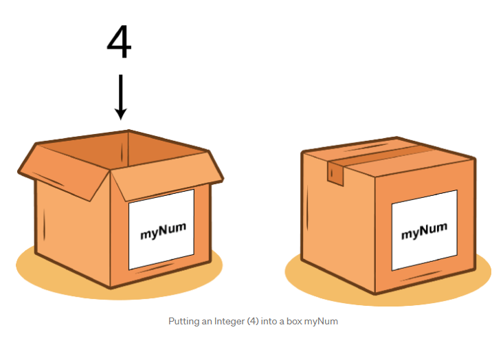
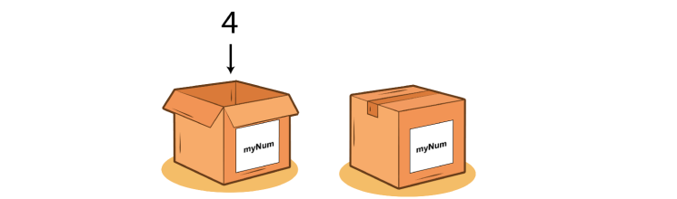
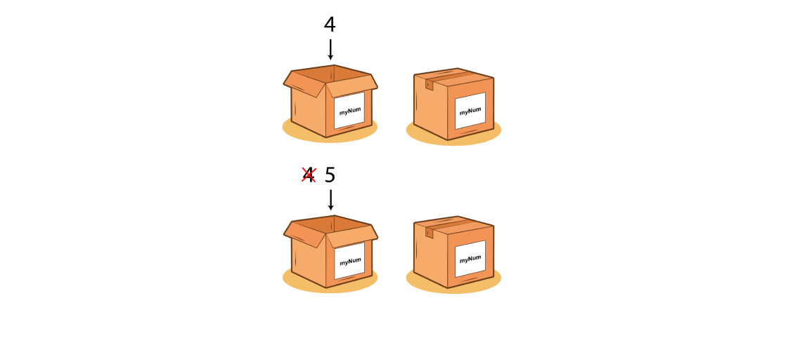
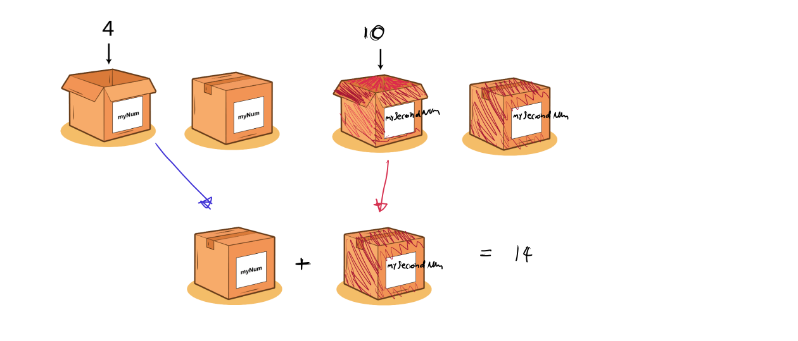
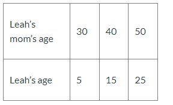
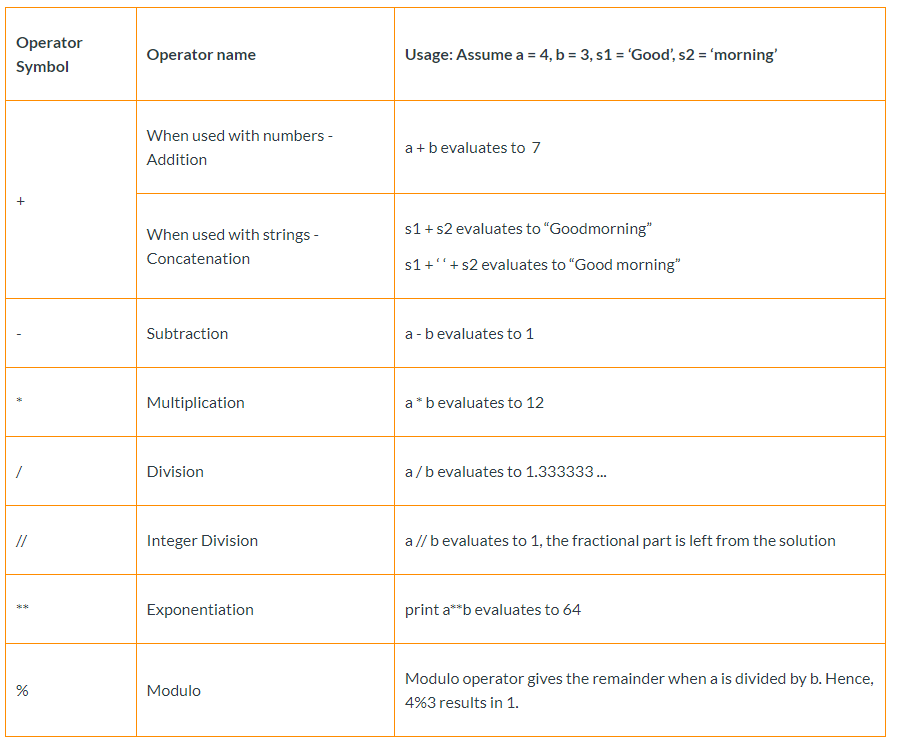
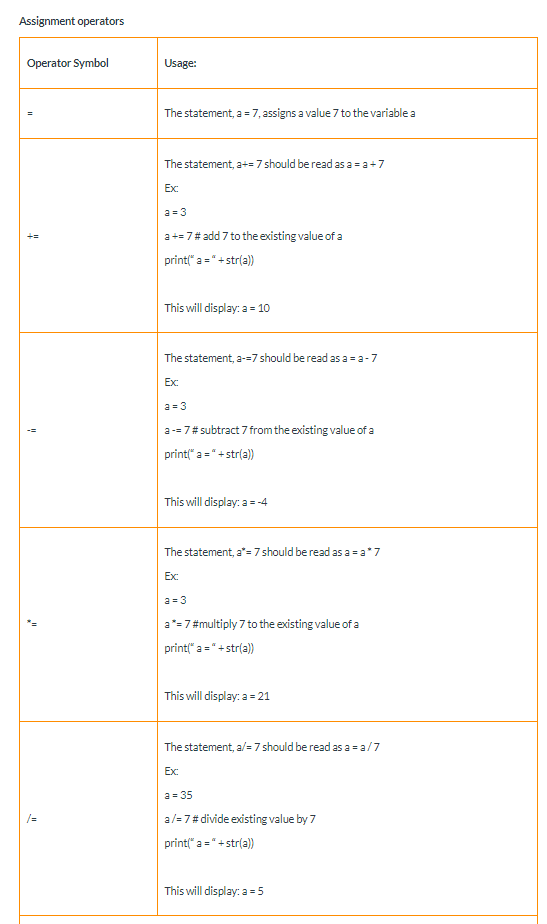
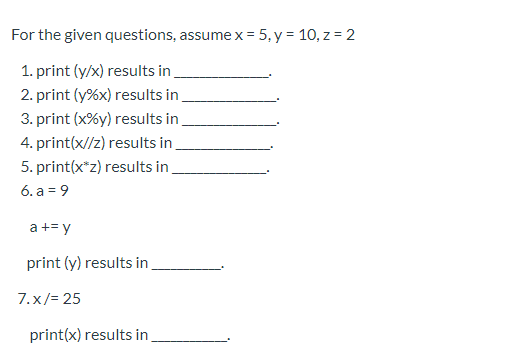

## Variables

### Introduction


:::note Variables are like boxes

<!--  -->


Image extracted from [StevenCurtis Medium](https://stevenpcurtis.medium.com/what-is-a-variable-3447ac1331b9)
:::

```python
myNum =  4
print(myNum)
# print(myNum+1)
```

<details>
<summary>
🧪 Try the code out! 
</summary>
<iframe src="https://trinket.io/embed/python/b2edae9fe5" width="100%" height="300" frameborder="0" marginwidth="0" marginheight="0" allowfullscreen></iframe>

</details>

### Re-assigning values to variables

:::note Addng a different Object into the box

Image extracted from [StevenCurtis Medium](https://stevenpcurtis.medium.com/what-is-a-variable-3447ac1331b9)
:::

```python
myNum =  4 
print(myNum) 
myNum = 5
print(myNum) 
```


<details>
<summary>
🧪 Try the code out! 
</summary>
<iframe src="https://trinket.io/embed/python/81a661f2eb" width="100%" height="300" frameborder="0" marginwidth="0" marginheight="0" allowfullscreen></iframe>

</details>


### Operations using variables

```python
myNum =  4
mySecondNum = 10
print(myNum + mySecondNum) 
```

<details>
<summary>
🧪 Try the code out! 
</summary>
<iframe src="https://trinket.io/embed/python/02335cd571" width="100%" height="300" frameborder="0" marginwidth="0" marginheight="0" allowfullscreen></iframe>

</details>


## Usage Example



### Using Examples and doing math with it.
```python
mom_age = 40 # Mmom_age represents mom's age # Line 3

leah_age = mom_age - 25 # leah_age represents Leah's age # Line 4

print("Age of Leah's mom is " + str(mom_age)) # typecast all data into string type    # Line 5
print ("Age of Leah is " + str(leah_age)) # there is an additional whitespace in the text to improve readablity # Line 6
```

<details>
<summary>
🧪 Try the code out! 
</summary>
<iframe src="https://trinket.io/embed/python3/7f0196f87d" width="100%" height="300" frameborder="0" marginwidth="0" marginheight="0" allowfullscreen></iframe>

</details>


## Arithmetic Operators




## Assigment Operators




## Practice Activities: Apples 🍎

:::tip Count of Apples 🍎
write a program that tracks the mumber of apples the user ends up with after starting with a set number of apples. Students  can set the initial number of apples to a number of their choice. The output should follow this script:

**Intended Output**
```Output
You have 20 apples.
You plant one tree from a seed you found in your attic and harvest five apples from it. You now have 25 apples.
You extract seeds from every apple you have, discard the apples, and plant all the seeds. You harvest four times as many apples as you had. You now have 100 apples.
You look over your apples and realize some of the trees were diseased! You have to throw out half of your apples. You now have 50.0 apples.
You decide to bake an apple pie. This requires six apples. You now have 44.0 apples.
```

<details>
<summary>
✍  You can solve the problem <b>by fixing the following code</b> using Trinket
You can see that the code prints 20 in each instance instead of <b>25</b> | <b>100</b> | <b>50</b> | <b>44</b>
</summary>
<iframe src="https://trinket.io/embed/python/f596202714" width="100%" height="600" frameborder="0" marginwidth="0" marginheight="0" allowfullscreen></iframe>

</details>

:::

## Arithmetic Operators Practice




<details>
<summary>
📒 Solution
</summary>
<iframe src="https://trinket.io/embed/python3/85939a160b" width="100%" height="600" frameborder="0" marginwidth="0" marginheight="0" allowfullscreen></iframe>

</details>

## Hiking Problem
Pete and Shannon are hiking. Shannon is always 2 miles ahead of Pete. What is the distance Shannon has covered if Pete has covered 10 miles? How would the program change if Shannon has covered twice as much distance as Pete?


<details>
<summary>
📒 Example
</summary>
<iframe src="https://trinket.io/embed/python3/b65afedb60" width="100%" height="600" frameborder="0" marginwidth="0" marginheight="0" allowfullscreen></iframe>

</details>

### Activity
<details>
<summary>
📝 Assigment: Shannon position changed. Can you complete the program so it prints the updated direction?
</summary>
<iframe src="https://trinket.io/embed/python3/0eb7a60624" width="100%" height="600" frameborder="0" marginwidth="0" marginheight="0" allowfullscreen></iframe>

</details>


