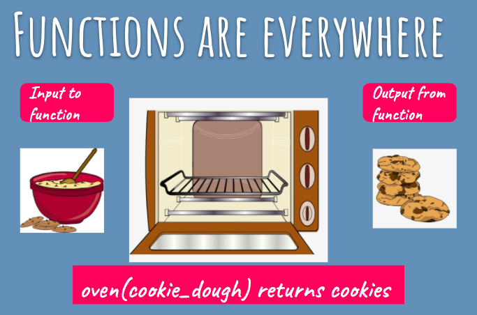

<details>

<summary>Animation</summary>

[extracted from Runestone Academy](https://runestone.academy/ns/books/published/fopp/Functions/Returningavaluefromafunction.html)


</details>

## Built in Functions

[👀](https://learn2codelive.com/courses/4/pages/lesson-2-learning-activities-e1-built-in-functions?module_item_id=487)

### Using + with strings.

we know that when we use `+` with numbers, the program will give us the mathematic operation of the sum of the numbers. But what happens when we have words?

```python
s1 = "Agent" # assign values to string 1 and string 2
s2 = "007"
print ("Using + with strings ")
print("String 1: " + s1) # print values of s1 and s2
print("String 2: " + s2)
print ("String 1 + String 2: " + s1 + s2) # concatenation of strings - Line 18
print("")
```

<details>
<summary>
🧪 Try the code out! 
</summary>
<iframe src="https://trinket.io/embed/python/5b75bb1c60" width="100%" height="600" frameborder="0" marginwidth="0" marginheight="0" allowfullscreen></iframe>

</details>

### str(), min(), max()

```python
# Part 1
a = 12 # assign value to variable a
b = 3 # assign value to variable b
c = 4 # assign value to variable c
print ("a: " + str(a) + " b: " + str(b) + " c: " + str(c) ) # print values for a, b and c
print ("Minimum of a, b and c is " + str(min(a,b,c) ) ) # print minimum value among a, b and c  # Line 8
print ("Maximum of a, b and c is "+ str(max(a, b, c) ) ) # print maximum value among a, b and c  # Line 9
print("") # print an empty line
print("")

```

<details>
<summary>
🧪 Try the code out! 
</summary>
<iframe src="https://trinket.io/embed/python/9586bbd5f7" width="100%" height="600" frameborder="0" marginwidth="0" marginheight="0" allowfullscreen></iframe>

</details>

### int() Converting Words into Integers

```python
# Part 3
a = 12 # assign value to variable a
s2 = "007"

print ("A string which holds a number can be changed to number data type like this:")
s2_as_a_num = int(s2) # typecasting a number into a string
print("sum of a and s2_as_a_num: " + str(s2_as_a_num + a)) # adding a typecasted number with another

```

<details>
<summary>
🧪 Try the code out! 
</summary>
<iframe src="https://trinket.io/embed/python/4809849c86" width="100%" height="600" frameborder="0" marginwidth="0" marginheight="0" allowfullscreen></iframe>

</details>

### pow() and abs()

[👀](https://learn2codelive.com/courses/4/pages/lesson-2-learning-activities-e1-built-in-functions?module_item_id=487)

```python
a = 8
b = 2
c = -9
d = 9.9
print(pow(a,b)) # returns a raised to the power b
print(pow(d,0)) # returns d raised to the power of 0
print(abs(c)) # returns the absolute value of c
print(abs(d)) # returns the absolute value of d
```

<details>
<summary>
🧪 Try the code out! 
</summary>
<iframe src="https://trinket.io/embed/python/387e994c8c" width="100%" height="300" frameborder="0" marginwidth="0" marginheight="0" allowfullscreen></iframe>

</details>

import IconAdmonition from "@site/src/components/IconAdmonition.js";

### Exercise

[👀](https://learn2codelive.com/courses/4/pages/lesson-2-learning-activities-r-practice-activity-3-apples?module_item_id=490)

<IconAdmonition icon="📝" title="Exercise: Counting Apples"  >

write a program that tracks the mumber of apples the user ends up with after starting with a set number of apples. Students can set the initial number of apples to a number of their choice. The output should follow this script:

```
You have ___ apples.
You plant one tree from a seed you found in your attic and harvest five apples from it. You now have ___ apples.
You extract seeds from every apple you have, discard the apples, and plant all the seeds. You harvest four times as many apples as you had. You now have ___ apples.
You look over your apples and realize some of the trees were diseased! You have to throw out half of your apples. You now have ___ apples.
You decide to bake an apple pie. This requires six apples. You now have ___ apples.
```


Example Output
```output
You have 20 apples.
You plant one tree from a seed you found in your attic and harvest five apples from it. You now have 25 apples.
You extract seeds from every apple you have, discard the apples, and plant all the seeds. You harvest four times as many apples as you had. You now have 100 apples.
You look over your apples and realize some of the trees were diseased! You have to throw out half of your apples. You now have 50.0 apples.
You decide to bake an apple pie. This requires six apples. You now have 44.0 apples.
```


<details>
<summary>
✍  You can solve the problem <b>here</b> using Trinket
</summary>
<iframe src="https://trinket.io/embed/python/b805c91ed1" width="100%" height="600" frameborder="0" marginwidth="0" marginheight="0" allowfullscreen></iframe>

</details>

</IconAdmonition>
