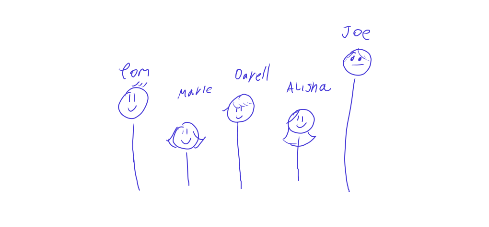
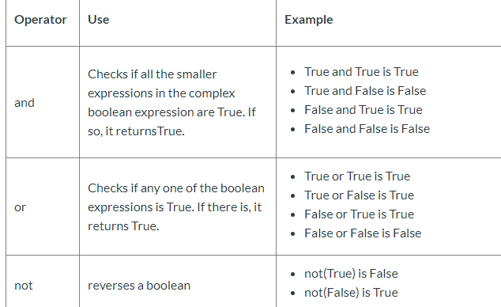

## Introducing Boolean Expression

[👀](https://learn2codelive.com/courses/4/pages/lesson-4-learning-activities-e1-introduce-boolean-expression?module_item_id=1660)

 
| Boolean Expression | Aithmetic Expression |
| ------------------ | -------------------- |
| 2 > 3              | 2+3                  |


| Comparison Operator | Definition       | Example                     |
| ------------------- | ---------------- | --------------------------- |
| `==`                | Equals           | 2==2 -> True, 2==4 -> False |
| `!=`               | Not Equal        | 2!=3 -> True, 2!=2 -> False |
| `>`                 | Larger           | 3>2 -> True                 |
| `<`                 | Smaller          | 4 < 5 -> True               |
| `>=`                | Larger or Equals | 4 >= 2 -> True, 2>=2 -> Tru |



<iframe src="https://trinket.io/embed/python/83d46bc5c7" width="100%" height="600" frameborder="0" marginwidth="0" marginheight="0" allowfullscreen></iframe>


:::tip Practice
Complete the following using the correct Boolean Expressions:
- Note we are using `ages` now.
- In Line `8` you can see how inside of `str()` we have the Boolean Expression for answering the statement `Tom is of the same age as Marie`
- Complete with the appropriate Boolean expressions in line `12`, `13`, `14`

<iframe src="https://trinket.io/embed/python/88ebe66e03" width="100%" height="400" frameborder="0" marginwidth="0" marginheight="0" allowfullscreen="true"></iframe>

***

🙋‍♀️ Correct Output

*py-l4b-print-x*

```
Tom is of the same age as Marie: False
Tom is older than Marie: True
Marie is younger than Alisha: True
Joe is as old as Tom: True
```

:::


## Logical Operators

[👀](https://learn2codelive.com/courses/4/pages/lesson-4-learning-activities-e1-introduce-logical-operator?module_item_id=1663)




<iframe src="https://trinket.io/embed/python/6b8543838f" width="100%" height="600" frameborder="0" marginwidth="0" marginheight="0" allowfullscreen></iframe>

:::tip Practice

Complete the following code with appropriate logical expressions

<iframe src="https://trinket.io/embed/python/182bc06c71" width="100%" height="600" frameborder="0" marginwidth="0" marginheight="0" allowfullscreen></iframe>


***

🙋‍♀️ Correct Output

*x-py-l4c-booleanexpressions*

```
Tom is older than Marie and Darell: True
Tom is older than Darell and Alisha: True
Marie is younger than Darell and Alisha: True
```

:::

## Integrated Exercise

### Hard: Fair Ride

:::tip Fair Ride
`
Fair Ride: Create a boolean expression that will be true or false for the given situation.

The situation is this: You’d like to go on a ride at the fair, but you have to meet the following criteria. You must  be over 5 feet tall or have your parent with you to go on the ride. You may use the following variables -

height - int

hasParent - boolean

canRide - boolean


i) Accept user input for height and hasParent. To accept a boolean value from the user, typecast the user’s input to bool(). User needs to write something => true or nothing => false.


ii) Use comparison operator to write a boolean expression that will evaluate to True or False depending on whether or not height is more than 5 feet. Output the value of the boolean expression. 


iii) Use logical operator to combine hasParent and the boolean expression from (ii) to construct a complex boolean expression and save the result in canRide. canRide evaluates to True if either hasParent or the boolean expression from (ii) is True. Output the value of canRide.


<iframe src="https://trinket.io/embed/python/8cb01b2471" width="100%" height="600" frameborder="0" marginwidth="0" marginheight="0" allowfullscreen></iframe>

***

🙋‍♀️ Sample Program

<iframe src="https://trinket.io/embed/python/8497595b51?outputOnly=true&start=result" width="100%" height="300" frameborder="0" marginwidth="0" marginheight="0" allowfullscreen></iframe>

:::