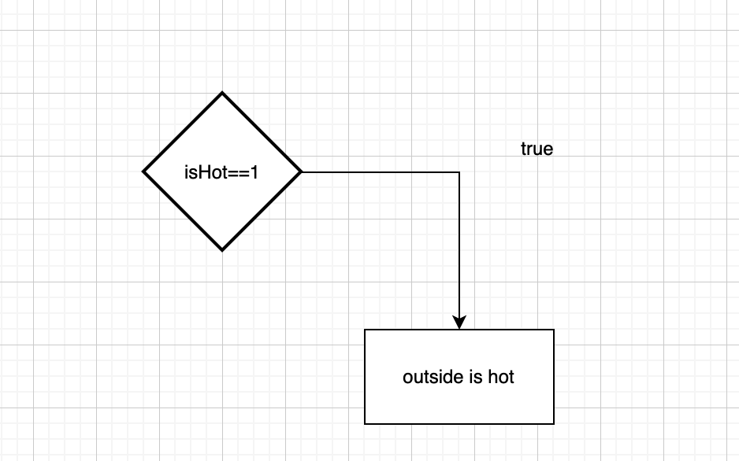
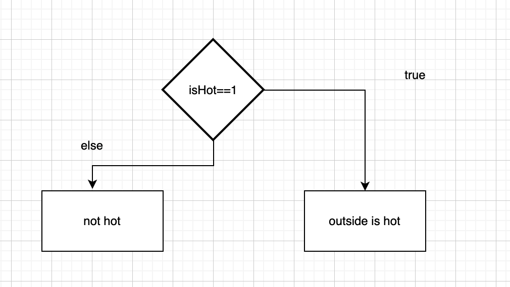

[👀](https://learn2codelive.com/courses/4/pages/lesson-4-learning-activities-e1-introduce-conditionals?module_item_id=1666)


## If Condition




```python
isHot = int(input("Is it hot outside? Enter 1 if it is"))

#use if statement to check if user has entered 1
if isHot == 1:
  print('Outside is hot')      # Line 9

```


<details>
<summary>
🧪 Try the code out~!
</summary>
<iframe src="https://trinket.io/embed/python3/62b0ea9cd8" width="100%" height="600" frameborder="0" marginwidth="0" marginheight="0" allowfullscreen></iframe>

</details>


## Else Condition
```python
isHot = int(input("Is it hot outside? Enter 1 if it is"))

#use if statement to check if user has entered 1
if isHot == 1:
  print('Outside is hot')      # Line 9
else:
  print("not hot")

```

<details>
<summary>
🧪 Try the code out~!
</summary>
<iframe src="https://trinket.io/embed/python3/29fc0151ed" width="100%" height="600" frameborder="0" marginwidth="0" marginheight="0" allowfullscreen></iframe>

</details>

:::tip Exercise 1

Fix the following program
Problem:
- No matter what you enter it prints "Outside is hot"
- Fix the program so that it prints "Outside is hot" if `isHot` = `2`


<iframe src="https://trinket.io/embed/python3/ebdd69524a" width="100%" height="300" frameborder="0" marginwidth="0" marginheight="0" allowfullscreen></iframe>

:::

:::important Time to work on our project!
Click here to go to [Zodiac Sign Project](/python/project/project-4b)

You only need to complete this for this class. But if you would like to, feel free to peek into the topics below! 
:::


## Checking Even and Odd numbers:

[👀 Lesson 4 Learning Activities [R] : Practice Activity 3 - Mathworks](https://learn2codelive.com/courses/4/pages/lesson-4-learning-activities-r-practice-activity-3-mathworks?module_item_id=1668)

- If `number` is odd the following program will print `false`.
- If `number` is even, the program will print `true`

```python


number = 4

print( number % 2 == 0)

```

<iframe src="https://trinket.io/embed/python3/110923fc1f" width="100%" height="300" frameborder="0" marginwidth="0" marginheight="0" allowfullscreen></iframe>

:::tip Exercise 2

- Modify the following program so that if the number is odd, it prints: `is Odd`
- And if it is even, it should print: `is Even`

<iframe src="https://trinket.io/embed/python/a4243efe5a" width="100%" height="300" frameborder="0" marginwidth="0" marginheight="0" allowfullscreen></iframe>

***
🙆‍♀️ Expected Program:
<iframe src="https://trinket.io/embed/python/1da65ebffb?outputOnly=true&start=result" width="100%" height="200" frameborder="0" marginwidth="0" marginheight="0" allowfullscreen></iframe>


:::


## Dictionary Order


[👀 Lesson 4 Learning Activities [R] : Practice Activity 5 - Dictionary Order](https://learn2codelive.com/courses/4/pages/lesson-4-learning-activities-r-practice-activity-5-dictionary-order?module_item_id=1679)

:::tip  Exercise 3
Write a program that asks user to enter 2 words and outputs them in the order they appear in the dictionary.

- hint: try running `"Bruce" < "Atom"`

<iframe src="https://trinket.io/embed/python/cb25c7fa3d" width="100%" height="600" frameborder="0" marginwidth="0" marginheight="0" allowfullscreen></iframe>

*** 
🙆‍♀️ Expected Program:
<iframe src="https://trinket.io/embed/python/4e615aee57?outputOnly=true&start=result" width="100%" height="300" frameborder="0" marginwidth="0" marginheight="0" allowfullscreen></iframe>

:::


## Guessing Game

[👀 Lesson 4 Learning Activities [R] : Practice Activity 6 - Secret Word](https://learn2codelive.com/courses/4/pages/lesson-4-learning-activities-r-practice-activity-6-secret-word?module_item_id=1681)

:::tip  Exercise 4
In this game, you define a secret word and have the user of the game guess the secret word. Give the user two hints to help guess the word. The hint could be description of the word or partial secret word. Display the appropriate description of the game, first hint and prompt for the user to guess the word. If the user guesses the word then display success message and exit the game. If not then display the second hint. If the user is unable to guess the secret word after all the hints then display the secret word at the end of the game.

*** 
🙆‍♀️ Expected Program:
<iframe src="https://trinket.io/embed/python/27242b6b94?outputOnly=true&start=result" width="100%" height="300" frameborder="0" marginwidth="0" marginheight="0" allowfullscreen></iframe>


***
👨‍🔬 Feel free to use this template

<iframe src="https://trinket.io/embed/python/a1b3bbf24a" width="100%" height="600" frameborder="0" marginwidth="0" marginheight="0" allowfullscreen></iframe>

:::

## Quiz About Me


[👀 Lesson 4 Learning Activities [E2] : Python Challenge 4b - Quiz About Me](https://learn2codelive.com/courses/4/pages/lesson-4-learning-activities-e2-python-challenge-4b-quiz-about-me?module_item_id=2371)

:::tip Exercise 5

Create the following quiz but for yourself

***
🙆‍♀️ Sample Program:
<iframe src="https://trinket.io/embed/python/e661236191?outputOnly=true&start=result" width="100%" height="300" frameborder="0" marginwidth="0" marginheight="0" allowfullscreen></iframe>

***
👨‍🔬 Feel free to use this template

<iframe src="https://trinket.io/embed/python/7687d7c5a4" width="100%" height="600" frameborder="0" marginwidth="0" marginheight="0" allowfullscreen></iframe>


:::
