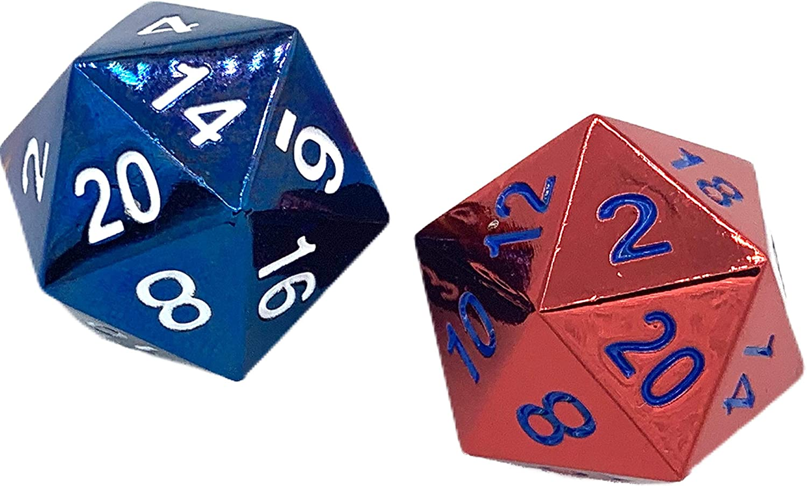

<!-- 
## Guessing game -->
<!-- 
- Don't worry about understanding this code yet, is just a demo of what we are going to learn today

<iframe src="https://trinket.io/embed/python/fc6294c369" width="100%" height="600" frameborder="0" marginwidth="0" marginheight="0" allowfullscreen></iframe>
 -->

## Randrange

[👀](https://learn2codelive.com/courses/4/pages/lesson-5-learning-activities-e1-introduce-random-module?module_item_id=2388)

```python
import random

print(random.randrange(10, 20))
```

<iframe src="https://trinket.io/embed/python/3759fa57b6" width="100%" height="600" frameborder="0" marginwidth="0" marginheight="0" allowfullscreen></iframe>


Possible random values in this range are: 10, 11, 12, 13, 14, 15, 16, 17, 18, 19

20 is out of this range as it returns values less than that specified as the second argument.

:::tip Practice
- Change the code above so it chooses a number from 30-39

:::


## Tossing a Coin

```python

import random
import time


print('This is a simulation of a coin toss')
print('Tossing coin now...\n')

time.sleep(1)

toss_result = random.randrange(0,2) 
#randrange generates a random number from the range of 0 to less than 2


#check what the value of toss_result is

if toss_result == 0: 
  print("Heads!")
else:
  print("Tails!")
```

<iframe src="https://trinket.io/embed/python/e43ae15e77" width="100%" height="600" frameborder="0" marginwidth="0" marginheight="0" allowfullscreen></iframe>

(i)  Does the user provide any input here?  No

(ii)  What are the possible outputs? Heads or Tails

(iii) Which line of code requires that the random module be imported? Line 7

(iv) What are the values stored by toss_result? 

0 and 1 only, comment line 8 helps in answering this question

## Exercise

:::tip Exercise
- Create a program to randomnly assign someone in either `blue` or `red` team

<iframe src="https://trinket.io/embed/python3/6de60da64b" width="100%" height="600" frameborder="0" marginwidth="0" marginheight="0" allowfullscreen></iframe>

*** 
🙋‍♀️ Sample program

<iframe src="https://trinket.io/embed/python3/8d4d56f9c7?outputOnly=true" width="100%" height="300" frameborder="0" marginwidth="0" marginheight="0" allowfullscreen></iframe>

:::

### Uniform

[👀](https://learn2codelive.com/courses/4/pages/lesson-5-learning-activities-e1-introduce-random-module?module_item_id=2388)

```python
import random

print(random.uniform(10, 20))
```

<iframe src="https://trinket.io/embed/python/c828ea9f12" width="100%" height="600" frameborder="0" marginwidth="0" marginheight="0" allowfullscreen></iframe>


## Dice

```python

import random

import time

print('This program simulates the throw of a dice')

print('Throwing the dice now...\n')

time.sleep(1)

face = random.randrange(1,7) # generate a random number in the range 1 to 6

print("You got a " + str(face))
```

<iframe src="https://trinket.io/embed/python/33663c3611" width="100%" height="600" frameborder="0" marginwidth="0" marginheight="0" allowfullscreen></iframe>

:::tip Practice: create a dice of 20




:::


<!-- 
## Librarian

```python

import random

print("Welcome! I am a virtual librarian!\n")
fav_book = int(input("What is your favorite book? "))
print()

book1 =("Harry Potter")
book2 =("Diary of a whimpy kid")
book3 =("Matilda")
book4 =("Fish in a tree")
book5 =("Bridge to Terabithia")


rand = random.randrange(1,6)
if rand == 1:
  print("If you like " + str(fav_book) + " then your should like " + book1 + ".")
if rand == 2:
  print("If you like " + str(fav_book) + " then your should like " + book2 + ".")
if rand == 3:
  print("If you like " + str(fav_book) + " then your should like " + book3 + ".")
if rand == 4:
  print("If you like " + str(fav_book) + " then your should like " + book4 + ".")
if rand == 5:
  print("If you like " + str(fav_book) + " then your should like " + book4 + ".")
  print("Your book choice is amazing!")
```

<iframe src="https://trinket.io/embed/python/a9615facc8" width="100%" height="600" frameborder="0" marginwidth="0" marginheight="0" allowfullscreen></iframe>


 -->
