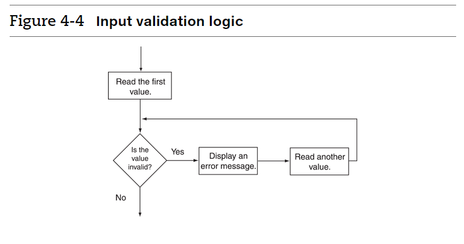

:::note While Loop


The BooleanExpression is tested, and if it is true, the Statement is executed. Then, the BooleanExpression is tested again. If it is true, the Statement is executed. This cycle repeats until the BooleanExpression is false.

:::

## While Loop


```java
import java.util.*;
class Main {
  public static void main(String[] args) {
    int number = 0;
    while (number<5)
    {
        System.out.println("Hello");
        number++;
    }
    
  }
}
```


<details>
<summary>
🧪 Try the code out~!
</summary>
<iframe src="https://trinket.io/embed/java/0aa8aff94e" width="100%" height="600" frameborder="0" marginwidth="0" marginheight="0" allowfullscreen></iframe>

</details>


## Infinite Loops

:::caution Be careful with no creating an infinite loop
This code will be printing `Hello for ever`:

```java
import java.util.*;
class Main {
  public static void main(String[] args) {
   int number = 1;
    while (number <= 5)
    {
       System.out.println("Hello");
    }
    
  }
}
```

<details>
<summary>
🧪 Try the code out~!
</summary>
<iframe src="https://trinket.io/embed/java/df212d025f" width="100%" height="300" frameborder="0" marginwidth="0" marginheight="0" allowfullscreen></iframe>

</details>

:::

## Practice

```java
int count = 10;
while (count < 1)
{
    System.out.println("Hello World");
    count++;
}
```

How many times will that code print `Hello World`?

import RadioListAns from "@site/src/components/RadioListAns.js";

<RadioListAns checkList={["5 times", "10 times"]} answer={2}></RadioListAns>


## Using While Loops to Validate Inputs



```java

import java.util.*;
class Main {
  public static void main(String[] args) {
  int number;

  // Create a Scanner object for keyboard input.
  Scanner keyboard = new Scanner(System.in);
  
  // Get a number from the user.
  System.out.print("Enter a number in the range of 1 through 100: ");
  number = keyboard.nextInt();
  
  // Validate the input.
  while (number < 1 || number > 100)
  {
     System.out.print("Invalid input. Enter a number in the range " +
                      "of 1 through 100: ");
     number = keyboard.nextInt();
  }
    
  }
}

```
<details>
<summary>
🧪 Try the code out~!
</summary>
<iframe src="https://trinket.io/embed/java/ec17c20097" width="100%" height="400" frameborder="0" marginwidth="0" marginheight="0" allowfullscreen></iframe>

</details>


