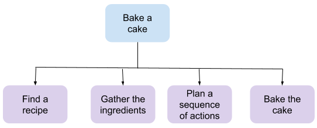

## Break Statement

```python
for i in range(100):
  print(i)
  if(i==8):
    break
```

<iframe src="https://trinket.io/embed/python/42bb35f64b" width="100%" height="300" frameborder="0" marginwidth="0" marginheight="0" allowfullscreen></iframe>

- Note how it stops when i==8
- What happens if you delete the: 
```
if(i==8):
    break
```
?

## Miner

[👀 Miners](https://learn2codelive.com/courses/4/pages/lesson-6-learning-activities-r-practice-activity-3-mining-for-diamonds?module_item_id=2589)

The following program 

```python

for i in range(1,8):

  print("\nEntering tunnel " + str(i))

  response = input("Enter Yes if diamonds are in this tunnel and No otherwise ")
  response = response.lower()
  if response == 'yes':

    print('Diamonds found after searching ' + str(i) + ' mines')

    print('Search stops here')

    break
```


<details>
<summary>
🧪 Try the code out~!
</summary>
<iframe src="https://trinket.io/embed/python/03601bf3a2" width="100%" height="600" frameborder="0" marginwidth="0" marginheight="0" allowfullscreen></iframe>

</details>


## Random Search

[👀 Random Search](https://learn2codelive.com/courses/4/pages/lesson-6-learning-activities-r-practice-activity-4-guessing-game-remix?module_item_id=2925)

<iframe src="https://trinket.io/embed/python/05d22a7e3e" width="100%" height="600" frameborder="0" marginwidth="0" marginheight="0" allowfullscreen></iframe>

## Computational Thinking

[👀 Computational Thinking](https://learn2codelive.com/courses/4/pages/lesson-6-learning-activities-e1-introduce-computational-thinking?module_item_id=2926)



