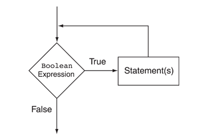

## While Loops
:::note While Loop



The BooleanExpression is tested, and if it is true, the Statement is executed. Then, the BooleanExpression is tested again. If it is true, the Statement is executed. This cycle repeats until the BooleanExpression is false.

:::

## Print Program Untill I tell you to stop

- Prints ``

```python
continueProgram="y"


while (continueProgram == "y"):
  print("Hello!")
  continueProgram = input("Continue program? y/n").lower()[0]
  
print("Program Terminated")
```


<details>
<summary>
🧪 Try the code out! 
</summary>

<iframe src="https://trinket.io/embed/python/0071632291" width="100%" height="600" frameborder="0" marginwidth="0" marginheight="0" allowfullscreen></iframe>

</details>


## Reusable Adder

The following program adds 2 numbers until the user tells it to stop

```python
programFinished="yes"


while (programFinished == "yes"):

    n1 = int(input("Enter number 1"))
    n2 = int(input("Enter number 2"))
    print(n1+n2)
    programFinished = input("Enter Yes if you want to continue using the calculator or No otherwise").lower()
```


<details>
<summary>
🧪 Try the code out! 
</summary>


<iframe src="https://trinket.io/embed/python/0e65658c48" width="100%" height="600" frameborder="0" marginwidth="0" marginheight="0" allowfullscreen></iframe>

</details>

## Exercise


*These are used when we just want them to play around with the code first.*

:::tip Practice

- Create a program that prints your name **in two lines** until you type `n`
- Use the following Canvas

<iframe src="https://trinket.io/embed/python/e653f4fffe" width="100%" height="600" frameborder="0" marginwidth="0" marginheight="0" allowfullscreen></iframe>


***

🙋‍♀️ Example of an the expected Program

<iframe src="https://trinket.io/embed/python/992f77470b?outputOnly=true&start=result" width="100%" height="300" frameborder="0" marginwidth="0" marginheight="0" allowfullscreen></iframe>


:::


## Turtle Example

<iframe src="https://trinket.io/embed/python/51e6cfaf75" width="100%" height="600" frameborder="0" marginwidth="0" marginheight="0" allowfullscreen></iframe>


