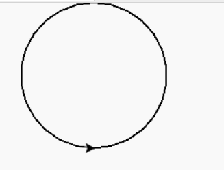
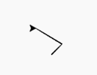
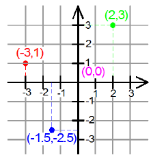
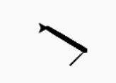

## Turtle

We first need to import turtle so we can start using turtle functions
```python
import turtle
```
<details>
<summary>
What is Turtle? 🐢
</summary>

a pre-installed Python library that enables users to create pictures and shapes by providing them with a virtual canvas

</details>

<details>
<summary>
What is a library? 📚 
</summary>
In python libraries are a collection of modules, containing code that can be
used in different programs.


**Analogy**: Suppose you have a set of questions about Biology, I don't know much about
biology, so Ideally I would like to invite (import) a biology teacher to our
class so you can ask him biology questions.


```python
#The biology teacher library probably doesn't exist, but this is just to show how this would it would translate in code
import biology_teacher
# We invite our biology teacher to the room

biology_teacher.askBiologyQuestion("Can I turn my cat into diamond?")
# and now we are asking our biology teacher a biology related question


```

**Why is it useful?**
Is useful to have libraries as a way to get access to precreated code that can
help us accelerate our programming (so we can focus on creating what we want
instead of the details of something)

</details>


### Drawing a circle

```python
import turtle

turtle.circle (100) # draws a circle with radius 100

```



```python
import turtle

turtle.circle (100, 180) # draws a semi-circle (first parameter is radius, second is degrees)

```


<details>
<summary>
🙋‍♂️ What do you think we would need to do in order to draw a quarter-circle with 40 of radio?
</summary>

```python
import turtle
turtle.circle (40, 360/4) # or 90
```

</details>

## Turtle Shape 🐢 ⚪ ⬛

We can change how the pen looks like
```python
turtle.shape('arrow')

turtle.shape('turtle')

turtle.shape('circle')

turtle.shape('square')

turtle.shape('triangle')

turtle.shape('classic')
```
## Picking the Pen up and down ✒

```python
turtle.penup()
turtle.circle (40, 360/4) 
turtle.pendown()
turtle.circle (40, 360/4) 
```


## Moving to Coordinates 🗺
We can out the pen down when we are ready to draw

```python
import turtle

turtle.goto(20, 20)
turtle.goto(-30, 50)

# turtle.home() #goes to (0,0)
```



<details>
<summary>
What are coordinates?
</summary>



</details>


## Speed 🏃‍♂️
```python

turtle.speed(5) # speed varies from 0 to 10
turtle.speed(0) # is the fastest, and speed increases from 1 to 10
```


## Width
```
turtle.width(5)
```


## Hiding and Showing Turtle
```python

turtle.hideturtle() # Hides the turtle
turtle.showturtle() # Shows the turtle
```


