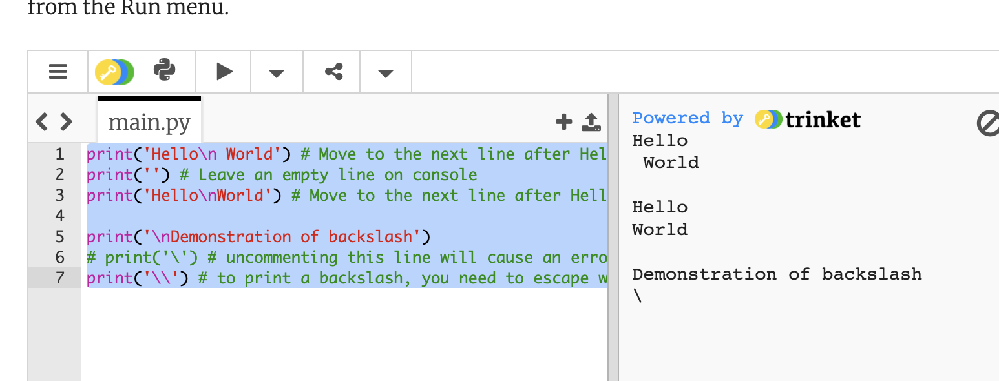

## Lesson 1 Printing

### Printing Messages
```python
print ("Hello World!")  # Print a message using double quotes
print ('Hello World!')  # Print a message using single quotes
```

### Printing numbers
```python
# This program displays some stuff  # Line 3
print ("Welcome to Python Programming")    # Line 4
print ("Try coding, it's fun. Do you know what is 123456789*123456789?") # Line 5
print (123456789*123456789)    # Line 6
```
Output
```output
# This program displays some stuff  # Line 3
print ("Welcome to Python Programming")    # Line 4
print ("Try coding, it's fun. Do you know what is 123456789*123456789?") # Line 5
print (123456789*123456789)    # Line 6
```

### Details

[Try it out](https://trinket.io/python3/31d9da2a08)
```python
print('Hello\n World') # Move to the next line after Hello
print('') # Leave an empty line on console
print('Hello\nWorld') # Move to the next line after Hello, white space before World has been removed here

print('\nDemonstration of backslash')
# print('\') # uncommenting this line will cause an error
print('\\') # to print a backslash, you need to escape with another backslash
```
Output:


[i](https://learn2codelive.com/courses/4/pages/lesson-1-learning-activities-r-practice-activity-1-build-and-test-the-code?module_item_id=458)


[i](https://learn2codelive.com/courses/4/pages/lesson-1-learning-activities-r-practice-activity-1-build-and-test-the-code?module_item_id=458)


