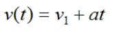

## Introductory Exercise: 

:::tip Calulating Profits
Profits are calulated as `Profit = Revenue - Cost`

The programmer who created the following code made a huge mistake and calculated profits as `Revenue + Cost` please fix this program!
<details>
<summary>
 🔨 Fix the program here:
</summary>
<iframe src="https://trinket.io/embed/python/a4f88da201" width="100%" height="600" frameborder="0" marginwidth="0" marginheight="0" allowfullscreen></iframe>

</details>
:::


:::tip Calculating Profit Margin

[What is Profit Margin? - ClayTrader business](https://www.youtube.com/watch?v=pgmtxQNKe9Q&ab_channel=ClayTrader)

Profit margins are calculated as `Profit Margin = (Net Profit / Revenue) * 100`
Finish the following program so that the program prints your

<details>
<summary>
 🔨 Fix the program here:
</summary>
<iframe src="https://trinket.io/embed/python/d03bc0e07a" width="100%" height="600" frameborder="0" marginwidth="0" marginheight="0" allowfullscreen></iframe>

</details>
:::


<details>
<summary>
 🔨 Fix the program here:
</summary>
<iframe src="https://trinket.io/embed/python/0cf1c4e60d" width="100%" height="600" frameborder="0" marginwidth="0" marginheight="0" allowfullscreen></iframe>

</details>

## Learning the secret of wealth: Compound Interest
This might be a concept harder to understand but here we have a program that approximates how rich you will be if you start investing in the stock market

```python
age_start_investing = 18
age_retirement = 60
# In percentages: 1.08 would be 8% interest
initial_investment = 1000
expected_yearly_interestgain = 1.08

worth_end =  1.08**(age_retirement - age_start_investing)
print("Your profits Margin is:")
# Write your code below
print("At age of 60 your $1000 will be:" + str(initial_investment*worth_end))

```
<details>
<summary>
🧪 Try the code out! 
</summary>

<iframe src="https://trinket.io/embed/python/c8557f8656" width="100%" height="600" frameborder="0" marginwidth="0" marginheight="0" allowfullscreen></iframe>


</details>


:::tip Exercise Calculating your future wealth.
<details>
<summary>
🧪 Play with the following code!
</summary>


Play around with the next python code
- Try changing the age you start investing (e.g. from 18 to 20)
- Try changing your initial investment (e.g. from 1000 to 2000)
- Try Changing the interest_rate (e.g. from 8 % yearly to 12%)


<iframe src="https://trinket.io/embed/python/b66cc4b608" width="100%" height="600" frameborder="0" marginwidth="0" marginheight="0" allowfullscreen></iframe>
</details>

:::


## Cheating your Physics Exam
The following program calculates the position of something based on variables:
These are the linear motion formulas


:::caution Disclaimer
I don't condone cheating or anything related to actual academic dishonesty, this
is just a what if scenario... 	٩(｡•́‿•̀｡)۶
:::


<!--  -->


Image extracted from [real-world-physics](https://www.real-world-physics-problems.com/rectilinear-motion.html)


:::tip Fix the following speed printer
The following program doesn't follow the formula properly please fix it (it should print `32` when `v1 = 2`, `aceleration = 3` and `time = 10`)
```python
initial_velocity =  2
aceleration = 3
time_elapsed = 10

print("Velocity of the object at time: "+ str(time_elapsed))
print(initial_velocity + aceleration)
```
:::


