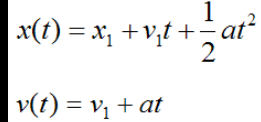

## Introductory Exercise: Calulating Profits
Profits are calulated as `Profit = Revenue - Cost`

The programmer who created the following code made a huge mistake and calculated profits as `Revenue + Cost` please fix this program!
<details>
<summary>
 🔨 Fix the program here:
</summary>
<iframe src="https://trinket.io/embed/python/a4f88da201" width="100%" height="600" frameborder="0" marginwidth="0" marginheight="0" allowfullscreen></iframe>

</details>

## Calculating Profit Margin

[What is Profit Margin?](https://www.youtube.com/watch?v=pgmtxQNKe9Q&ab_channel=ClayTrader)

Profit margins are calculated as `Profit Margin = (Net Profit / Revenue) * 100`
Finish the following program so that the program prints your

<details>
<summary>
 🔨 Fix the program here:
</summary>
<iframe src="https://trinket.io/embed/python/a4f88da201" width="100%" height="600" frameborder="0" marginwidth="0" marginheight="0" allowfullscreen></iframe>

</details>


## Compound Interest the secret to become rich.

## Using Python to cheat on exams

Hello everyone by the end of this class you will learn enough to create a
program that will help you cheat on your next Physics class.

:::caution Disclaimer
I don't condone cheating or anything related to actual academic dishonesty, this
is just a what if scenario... 	٩(｡•́‿•̀｡)۶
:::

## Cheating your Physics Exam
The following program calculates the position of something based on variables:
These are the linear motion formulas


Image extracted from [real-world-physics](https://www.real-world-physics-problems.com/rectilinear-motion.html)

The following program calculates the current speed of something based on it's initial speed, acceleration and time since the object started accelerating (v(t) )
```python

```


