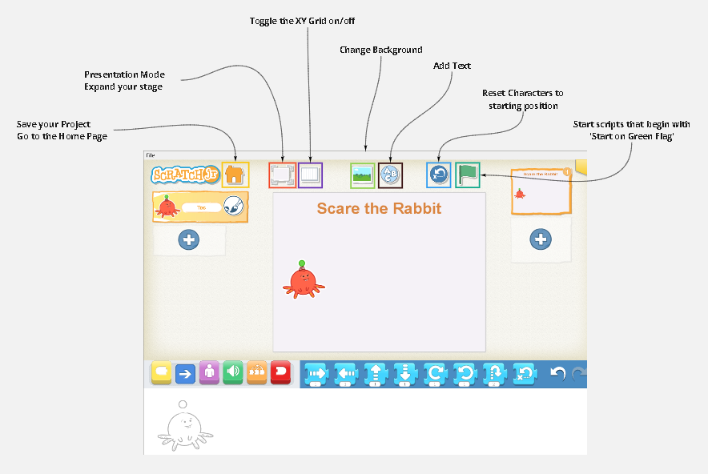
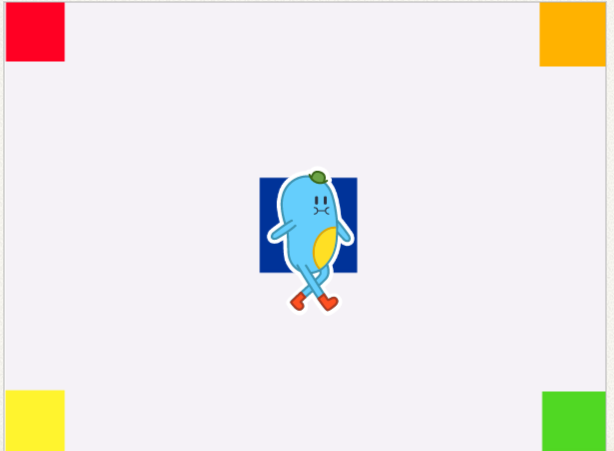

[🗒](https://learn2codelive.com/courses/121/assignments/2932?module_item_id=11012)

[👩‍🏫 Slides 1-2](https://docs.google.com/presentation/d/1bzi9-IQkNt-njNBER-AZSXDJJ07TXtq2/edit#slide=id.p1)

## Project 1 - My First Animation

We are going to play a game together! Look at the image of the board. What do you see?

Can you identify the following squares? Describe each square as you identify it. 

https://jfo8000.github.io/ScratchJr-Desktop/

1. The top left square: Orange with a smiley

2. The top right square: Spider square

3. The bottom left square: Spider square

4. The bottom right square: Orange with the number 5

5. The center square: Green with the number 2

### Rules of the game

Smile-E the robot is trapped in the board and needs your help! You need to give instructions to Smile-E such that they move across the board, avoid spiders, and reach the exit, which is the square situated in the bottom right of the board. 

### Rules

1. If you travel to a white square you get no points

2. If you travel to a square with the number 1, you get 1 point

3. If you travel to a square with the number 2, you get 2 points

### The directions game: Rounds

📝 Professor Notes

1. Ask for volunteers for the first round. Have them draw instructions to move one square to the right, one square to the left, one square to the bottom, and one square to the top such that they return to the starting square.
2. Have all students participate in the second round.

- This may be done individually or in pairs.
- Point out that the students need to reach the exit square in less than 10 steps.
- They need to draw all the instructions (directions along with values) such that each instruction is in one line. 
- Give students 5 mins to draw the instructions. Call for volunteers or volunteer groups and have them read out the instructions. Move Smile-E along with each instruction. If the robot reaches a spider, it goes back to the starting square. 
- For each student/student group, keep track of their points in each round. The game ends when they reach a spider or when they reach the exit square. 

3. Game extension ideas: Use these based on the 

- The robot can start with 5 points. Students lose a point when they travel to a white square. 
- Students should reach the exit in a specific number of steps
- Students should reach the exit with a specific number of points
- Students should avoid all points and collect all spiders 

### Sample Solution

### Homework

:::tip Moving the Character Around

Tic should start at the center of the stage (area with the blue square). Tic should then travel to the following squares in order:

1. Yellow
2. Red
3. Orange
4. Green

:::

