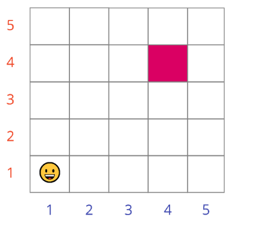
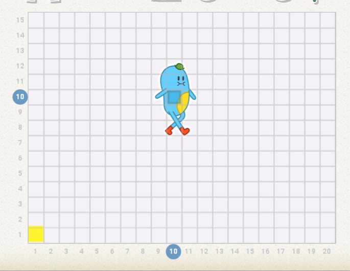
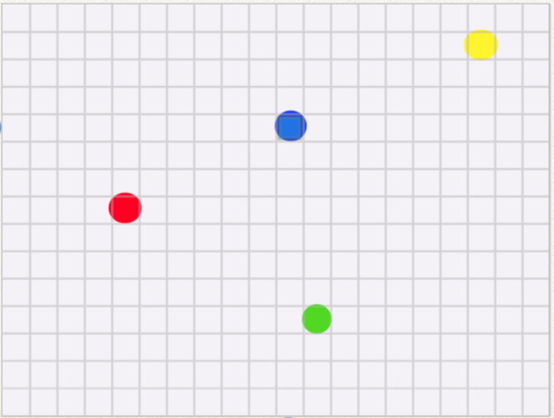

[👀](https://learn2codelive.com/courses/121/pages/project-1-lesson-2-le-the-scratch-jr-stage?module_item_id=11014)

[👩‍🏫 Slides 3](https://docs.google.com/presentation/d/1bzi9-IQkNt-njNBER-AZSXDJJ07TXtq2/edit#slide=id.p1)

:::tip Moving Squares

:::

1. Open the Grid view

:::tip Homework

'Tic' needs to reach the (15, 20) square which is the top right square in the grid. Along the way, it needs to collect the following coins - Red, Green, Blue, and Yellow. The coins are hidden in the squares and you cannot see them in the Scratch Jr. app! Use the image below to find out the names of the squares on which the coins are hidden.

Write a program that moves 'tic' to each of these squares before moving on to the last square (top right square). Experiment until you can do it with the minimum number of steps!

:::

:::note 🔗 Quiz Link

https://quizizz.com/admin/quiz/615084ed3967f1001dca5597/quiz

:::