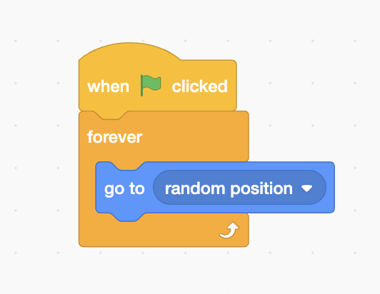
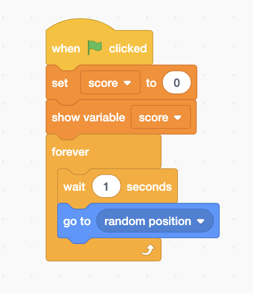
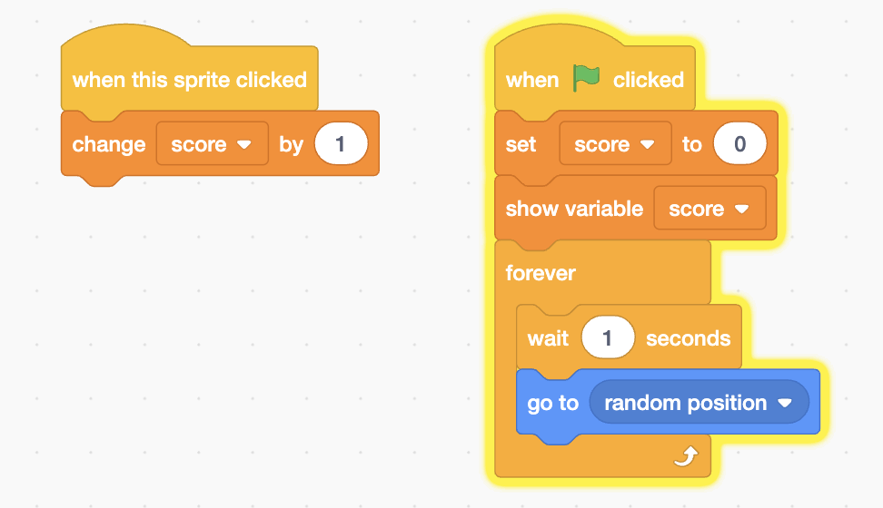
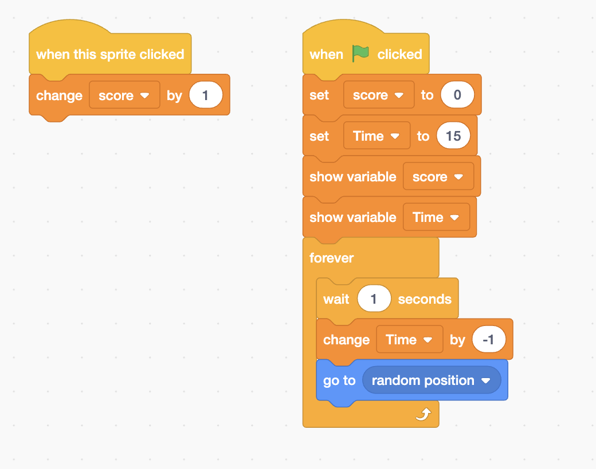
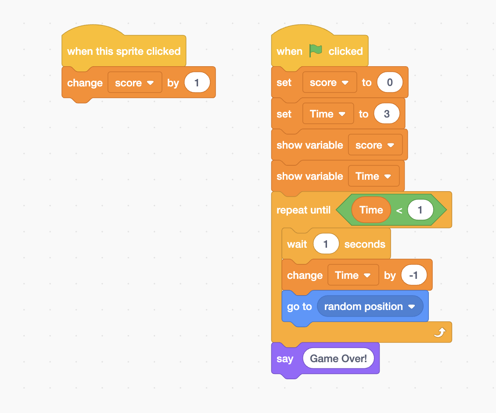

## Random Movement

<iframe src="https://giphy.com/embed/42zqiaGWe96oHTLBn5" width="480" height="302" frameBorder="0" class="giphy-embed" allowFullScreen></iframe>
<a href="https://giphy.com/gifs/42zqiaGWe96oHTLBn5">via GIPHY</a>

## Creating Variables (Score)

## Clicking and Increasing the Score

<iframe src="https://giphy.com/embed/B4bVxFvhEZcXkrwZ45" width="480" height="302" frameBorder="0" class="giphy-embed" allowFullScreen></iframe>
<a href="https://giphy.com/gifs/B4bVxFvhEZcXkrwZ45">via GIPHY</a>

## Advanced
### Adding Timer

<iframe src="https://giphy.com/embed/407OxWYR3956BJalUc" width="480" height="302" frameBorder="0" class="giphy-embed" allowFullScreen></iframe>
<a href="https://giphy.com/gifs/407OxWYR3956BJalUc">via GIPHY</a>

### Finish the game when the timer is over.

<iframe src="https://giphy.com/embed/4GHzuebbnDRdJCMkAs" width="480" height="302" frameBorder="0" class="giphy-embed" allowFullScreen></iframe>
<a href="https://giphy.com/gifs/4GHzuebbnDRdJCMkAs">via GIPHY</a>

