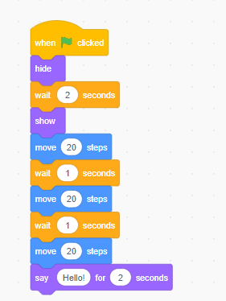
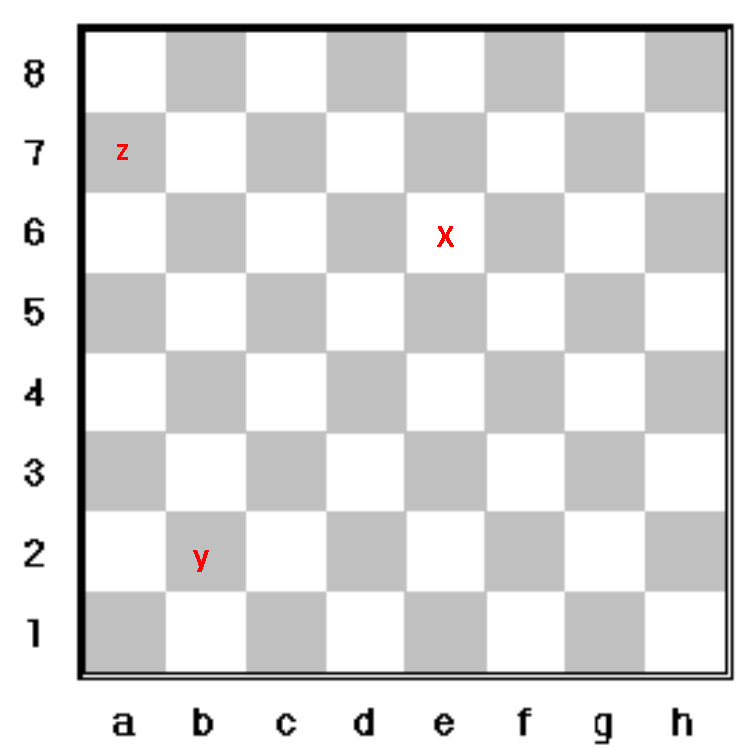
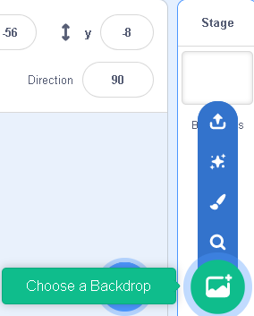
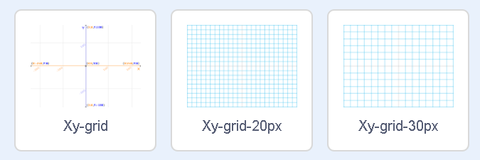

## Sequences

<iframe src="https://scratch.mit.edu/projects/713299413/embed" allowtransparency="true" width="485" height="402" frameborder="0" scrolling="no" allowfullscreen></iframe>

[Code](https://scratch.mit.edu/projects/713299413/editor/)

## Positions

:::note Can you identify the 'x', 'y' and 'z' squares in this image?

[Google Link](https://drive.google.com/file/d/1oiODRercEppQhidyqbNxUc-VuXWWKATb/view)

:::

### We can check by using our backdrops

:::note Steps

Each point on the Scratch backdrop is also defined by two values, one showing where it is positioned horizontally and vertically. 

Click on the 'add new backdrop' icon below the Sprites pane. 

Click on the 'search' icon and the backdrop library opens up. In the search bar, type in 'Xy Grid'. 

:::

[Mit - ](https://scratch.mit.edu/projects/713301211/editor)

- Observe that the 'x' axis extends from -240 to +240 with '0' being the center. 
- Observe that the 'y' axis extends from -180 to 180 with '0' being the center. 

