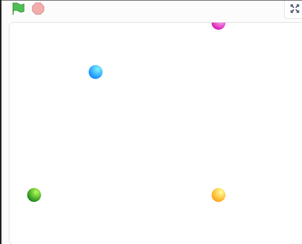

## Sequences

<iframe src="https://scratch.mit.edu/projects/713299413/embed" allowtransparency="true" width="485" height="402" frameborder="0" scrolling="no" allowfullscreen></iframe>

[Code](https://scratch.mit.edu/projects/713299413/editor/)

## Positions

:::note Can you identify the 'x', 'y' and 'z' squares in this image?

[Google Link](https://drive.google.com/file/d/1oiODRercEppQhidyqbNxUc-VuXWWKATb/view)

:::

### We can check by using our backdrops

:::note Steps

Each point on the Scratch backdrop is also defined by two values, one showing where it is positioned horizontally and vertically. 

Click on the 'add new backdrop' icon below the Sprites pane. 

Click on the 'search' icon and the backdrop library opens up. In the search bar, type in 'Xy Grid'. 

:::

[Mit - ](https://scratch.mit.edu/projects/713301211/editor)

- Observe that the 'x' axis extends from -240 to +240 with '0' being the center. 
- Observe that the 'y' axis extends from -180 to 180 with '0' being the center. 

## Programming Concepts

Computer Program: A series of instructions that tell a computer what to do.

Programming Languages: Programming languages are languages used by programmers to communicate with computers. Just as we communicate using different languages, programmers also communicate with computers in different ways.

Pseudocode: Series of instructions that are written in plain language without using a specific programming language or platform. 

Sequences: A series of related instructions arranged and executed one after another to complete a task or to solve a problem. 

Control Structures: Programming statements that control other commands or actions. An example is the 'wait' command that pauses a sequence for a specific period of time.

:::tip Homework Level 1

Use sequences and control structures to write a program in which one sprite relates a 'Knock Knock' joke to another.

:::

:::tip Homework Level 2

1. [Remix](https://scratch.mit.edu/projects/555867990)
2. Add a red ball that moves between the dots

:::

