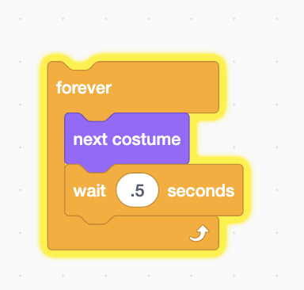
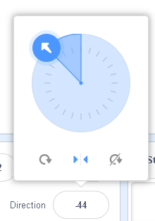

## Animate a Sprite

:::note Adding a bird to the scene

- Click on the bird Icon

- Note how it has two sprites

:::

### Repeat Block

:::note Animating the bird

:::

### Forever Block

:::note

- This will make the bird Fly forever

<iframe src="https://giphy.com/embed/RcMj43IhCJIEUzxWKu" width="480" height="308" frameBorder="0" class="giphy-embed" allowFullScreen></iframe>
<a href="https://giphy.com/gifs/forever-scratch-RcMj43IhCJIEUzxWKu">via GIPHY</a>

:::

## Sprite Rotation and Direction

<iframe src="https://giphy.com/embed/BtsyEdzNmdYAj8tyyu" width="480" height="308" frameBorder="0" class="giphy-embed" allowFullScreen></iframe>
<a href="https://giphy.com/gifs/scratch-rotation-BtsyEdzNmdYAj8tyyu">via GIPHY</a>

Answer the following questions:

What is the 'direction' value when the sprite is pointing right/East? 90

What is the 'direction' value when the sprite is pointing left/West? -90

What is the 'direction' value when the sprite is pointing down/South?180

What is the 'direction' value when the sprite is pointing up/North? 0

For this animation, make sure the Left/Right option is selected.

